# Adding Security to your APEX application

## Introduction

The autonomous philosophy takes our security to the next dimension. Keeping up to date in terms of security patches is very difficult. But in the scope of the ATP and its self-securing approach, the latest security patches will be applied transparently to our databases and that the best industry standards will be respected.

Transparent Data Encryption and Data Redaction are two very powerful features to protect our application data and both are native to the ATP due to the presence of the Advanced Security option of the Oracle database.

In this lab, we will take a walkthrough around some of the improvements that the ATP provides to APEX developers, in areas such as performance, monitoring and security.

Watch our short video that explains Lab 4 - Add Security to APEX:

[https://www.youtube.com/watch?v=sJDQg_l6fPY](youtube:sJDQg_l6fPY)

Estimated Time: 45 minutes

### Objectives
- Configure auto-scaling in our ATP instance and access the Performance Hub and learn how to monitor your ATP running your APEX applications.
- Learn what the how our application data will be secured in the ATP.
- Check the encryption of our data in our database.
- Create a schema on the database on SQL Developer Web with data redaction to be leveraged by an APEX application.
- Create an application on APEX that leverages the Advanced Security option to protect credit card information.

### Prerequisites

* An Oracle Cloud paid account or free trial. To sign up for a trial account with $300 in credits for 30 days, click [here](http://oracle.com/cloud/free).
* An Oracle Autonomous Transaction Process instance
* An APEX Workspace

## **STEP 1**: Accessing our Performance Hub
The Performance Hub is a great tool to monitor our ATP status and activity. It is accessible from the Service Console.

1. Open the Autonomous Database Details page and click **Performance Hub**.
	

2. In the upper part we will see the consumption of resources and waits of our sessions along time. In the lower part, we will be able to check the ASH (Active Session History) analysis, access the SQL Monitoring to analyze individual queries or even submit a session kill command.
	

## **STEP 2**: Checking our data encryption
Another immediate consequence of choosing the ATP as our database is that our database will be in the Cloud and, thus, our data will be encrypted everywhere: SQLNet Traffic, tablespaces, backups... everything. Even if an attacker achieved to get into the physical machine, the data would still be secure.

The Transparent Data Encryption (TDE) option takes care of all the details. To prevent unauthorized decryption, TDE stores the encryption keys in a security module external to the database, called a keystore.

1. Open SQL Developer Web. If you have don't have the direct link, go to the Service Console of the autonomous database, then Developer, then SQL Developer Web. You will need to use "ADMIN" as your user name and the password (`SecretPassw0rd`) we provided when we provisioned the instance.

  

  

2. Let's first check our data tablespaces and if they are encrypted. Query our tablespaces and their encryption status. We can see that, in our example, we have two data tablespaces, which belong to tablespaces number 4 and 5.

  	```
  	<copy>select * from V$TABLESPACE;</copy>
  	```
  	
  	

3. When we check the encryption status of both tablespaces, we find that by default they are encrypted.

  	```
  	<copy>select tablespace_name, status, encrypted from USER_TABLESPACES;</copy>
  	```
  	
  	
  	It is even more important to know that this status cannot change: any attempt to change their encrypted status in the Cloud will result in failure.

## **STEP 3**: Securing our sensitive information using data redaction
Even if the access to our application stays internal in our organization, sometimes data is allowed to be obtained only partially, with restrictions or even transformed. Data redaction is a powerful tool to enhance data governance security at the user level. Now we will create a new schema, configure it and populate it with the data we need to leverage data redaction in an APEX application.

1. Execute the following script (be sure to click **Run Script**):

    ```
    <copy>create user redact identified by "4P3X%ATP_sec_1";
    grant create session to redact;
    grant unlimited tablespace to redact;
    create table redact.credit_card
    (cust_id number(10) GENERATED ALWAYS AS IDENTITY START WITH 1000,
    enroll_date date NOT NULL,card_no number(16) NOT NULL,exp_date date NOT NULL,card_val varchar2(20));
    insert into redact.credit_card(enroll_date,card_no,exp_date,card_val) values  (sysdate,1285145836589848,TRUNC(ADD_MONTHS(SYSDATE,36)),'1111-2222-3333-4444');
    insert into redact.credit_card(enroll_date,card_no,exp_date,card_val) values (sysdate,8554884663181666,TRUNC(ADD_MONTHS(SYSDATE,36)),'5555-2222-3333-8888');
    insert into redact.credit_card(enroll_date,card_no,exp_date,card_val) values (sysdate,6543884663181666,TRUNC(ADD_MONTHS(SYSDATE,36)),'9999-1111-6655-8888');
    insert into redact.credit_card(enroll_date,card_no,exp_date,card_val) values (sysdate,7343884663184583,TRUNC(ADD_MONTHS(SYSDATE,36)),'2222-4444-6655-1111');
    commit;</copy>
    ```

2. If we run a select on the table we should get the following rows:

  	```
  	<copy>select * from redact.credit_card;</copy>
  	```
  	

## **STEP 4**: Create Secure APEX Application

1. We are ready to create our application on APEX. Open APEX from the Service Console of the autonomous database, then Developer, then APEX.

2. Click **Administration Services**.

  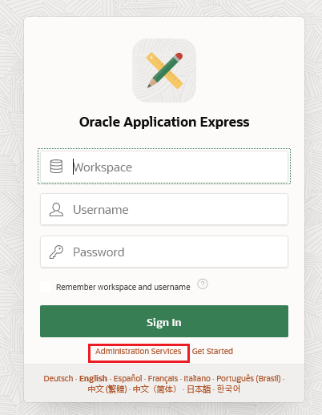

3. Enter your admin password.

  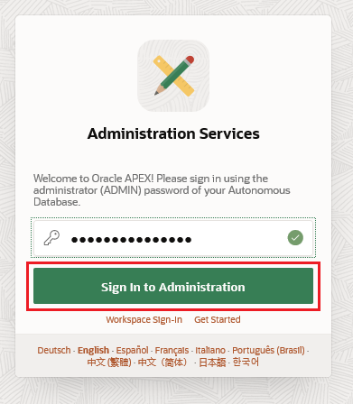

4. Click **Create Workspace**

  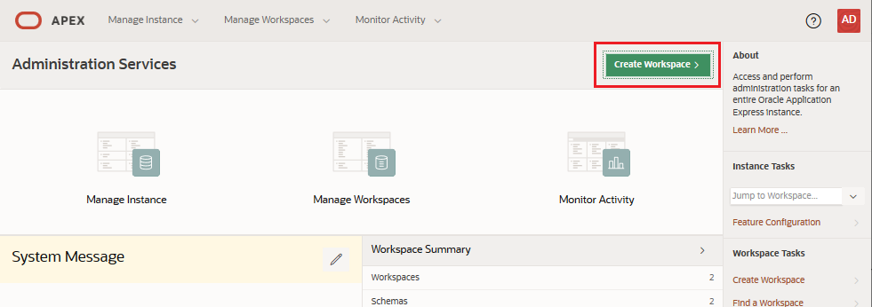

5. Use select icon to the right of Database User to select the REDACT user and click **Create Workspace**:

	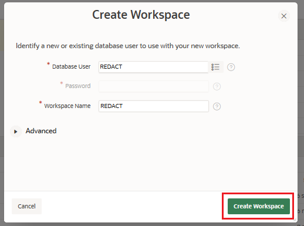

6. Click the **REDACT** link to sign out of Administration Services and sign into REDACT.

	

7. Sign in with the REDACT user in APEX. Use `4P3X%ATP_sec_1` as the account password, when prompted:

	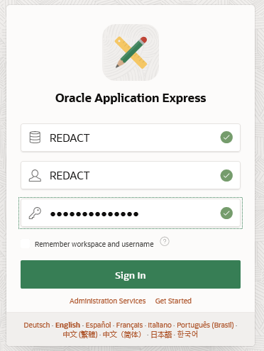

8. Click **Set APEX Account Password**.

	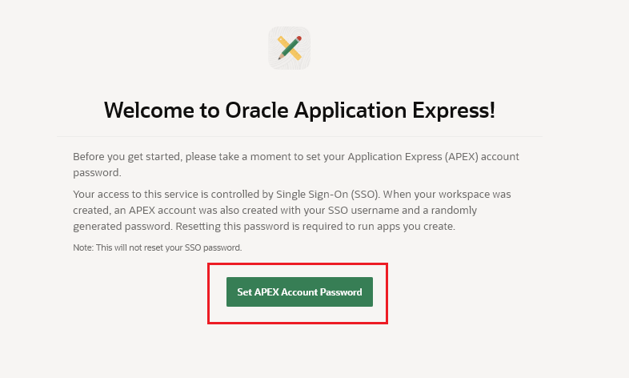

9. On the Edit Profile screen, enter your e-mail address, enter `4P3X%ATP_sec_1` as the password and click **Apply Changes**.

	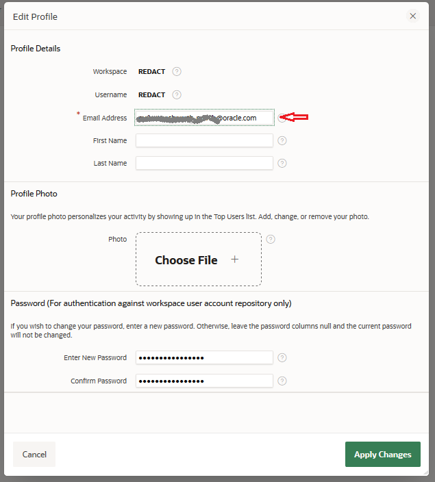

10. Now we will create our application. Click on the **App Builder** icon, then **Create** and finally **New Application**.

	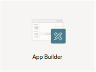

11. Enter "RedactApp" as the name of our new Application and click **Add Page**.

	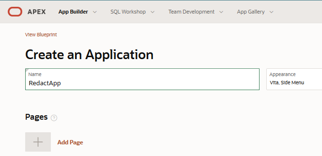

12. Select **Interactive Report** in the list of available options.

	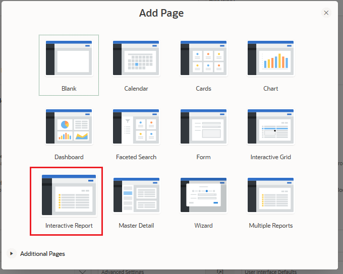

13. Enter "Credit Card" as the name of the new page and click on the List icon to the right of "Table or View". Select the CREDIT\_CARD table from the list.

    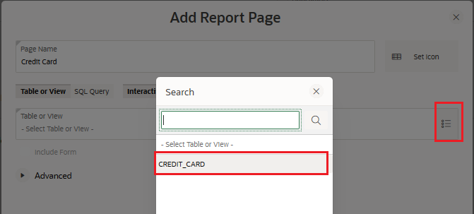

    Expand the Advanced options and select *Set as Home Page* and then select **Add Page.**

    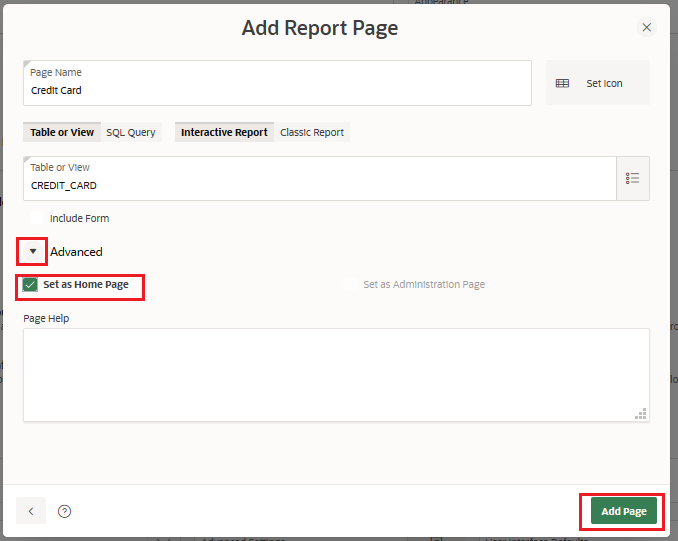

14. The configuration is ready and now we can create our app. Click **Create Application** at the bottom of the window. When the app is ready.

	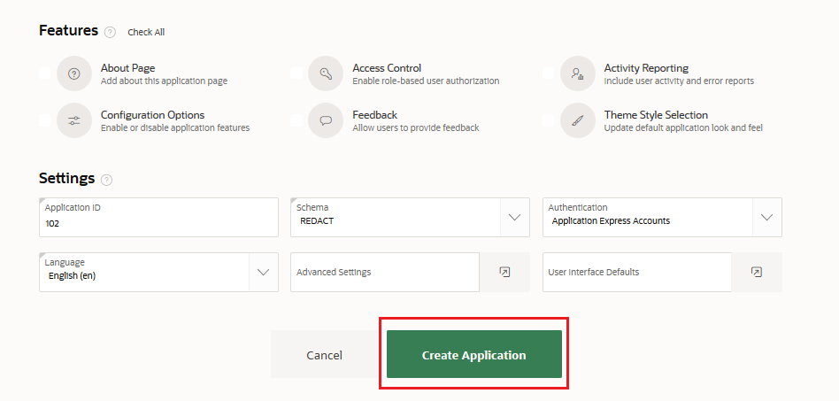

15. Click **Run Application** and authenticate in our new application with the REDACT user and the password we chose (e.g. `4P3X%ATP_sec_1`). We will see our application with the values from the CREDIT\_CARD table.

	

	As we anticipated, we have sensitive data in our table. The `card_val` column requires data redaction to avoid exposing the full credit card numbers to the users. In our example, we will show only the last four numbers.

	

16. Go back to SQL Developer Web, login as the ADMIN user and run the following PL/SQL snippet to create the proper policy on it:

  	```
  	<copy>BEGIN
  	DBMS_REDACT.ADD_POLICY(
  	object_schema          => 'redact',
  	object_name            => 'credit_card',
  	column_name            => 'card_val',
  	policy_name            => 'redact_REG_EXP',
  	 function_type       => DBMS_REDACT.PARTIAL,
  	   function_parameters => 'VVVVFVVVVFVVVVFVVVV,VVVV-VVVV-VVVV-VVVV,*,1,12',
  	   expression          => '1=1',
  	   policy_description  => 'Partially redacts our credit card numbers',
  	   column_description  => 'card_val contains credit card numbers in VARCHAR2 format');
  	END;
  	/</copy>
  	```
17. Once the snippet has been executed successfully, refresh the page in our application. The credit card numbers now will be protected by the data redaction. They will not leave our database in a vulnerable condition anymore.


## Conclusion

  - You have checked the encryption status of your application data in the ATP.
  - You have learned how to leverage the data redaction from the Advanced Security feature in order to protect your sensitive data in your application even before it leaves your ATP.

## Acknowledgements
* **Author** - Juan Cabrera Eisman, Senior Technology Solution Engineer, Oracle Digital, Melanie Ashworth-March, Master Principal Sales Consultant, EMEA Oracle Solution Center
* **Last Updated By/Date** - Melanie Ashworth-March, Principal Sales Consultant, EMEA Oracle Solution Center, January 2021
