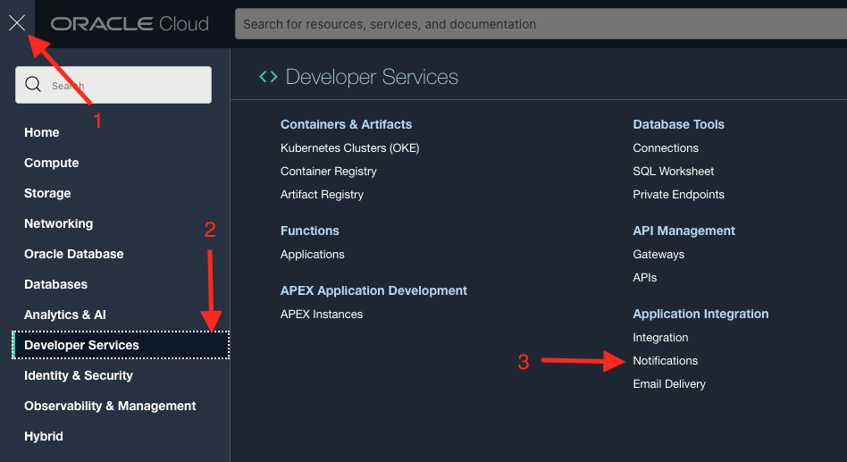
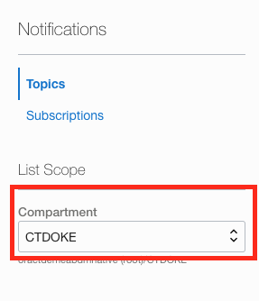
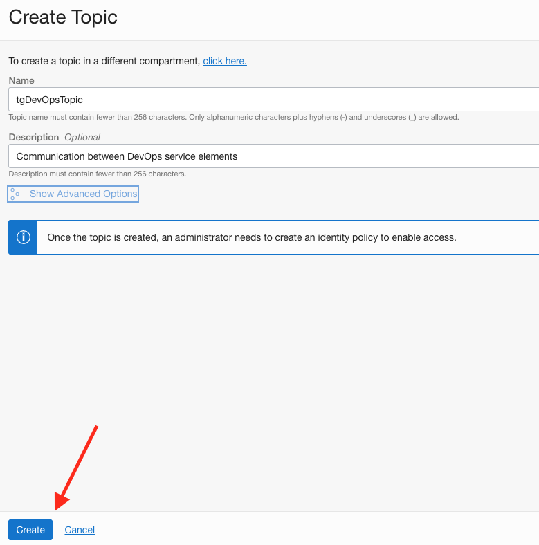
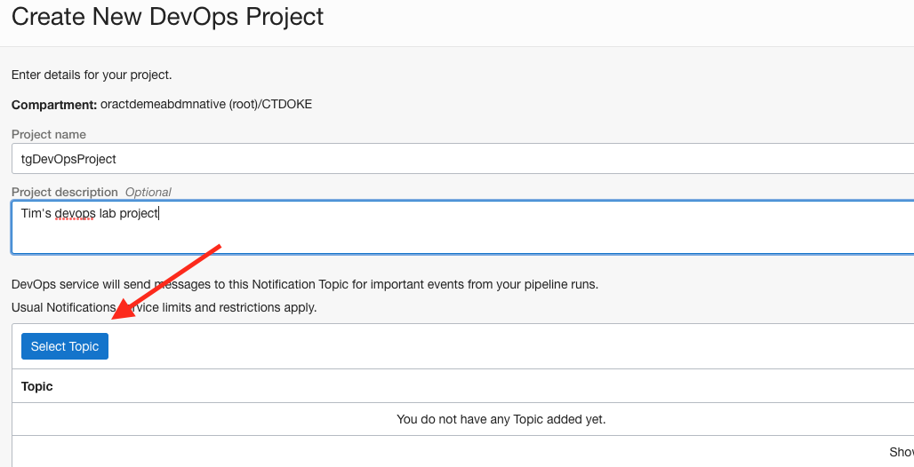
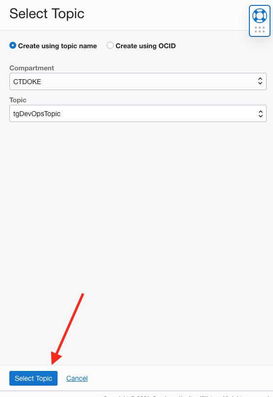
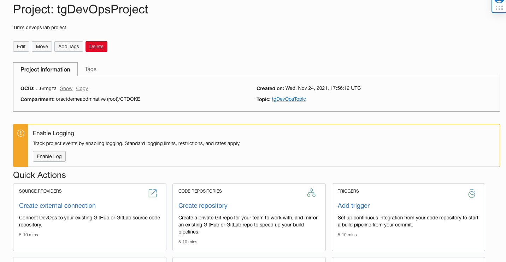
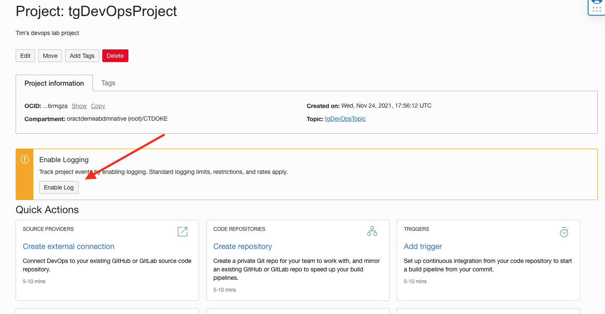
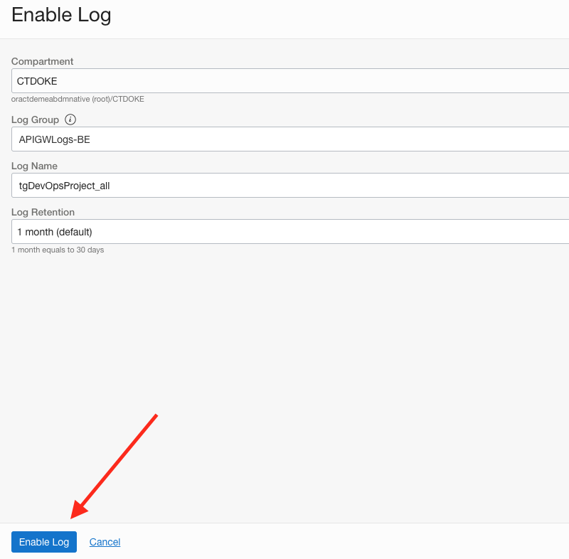
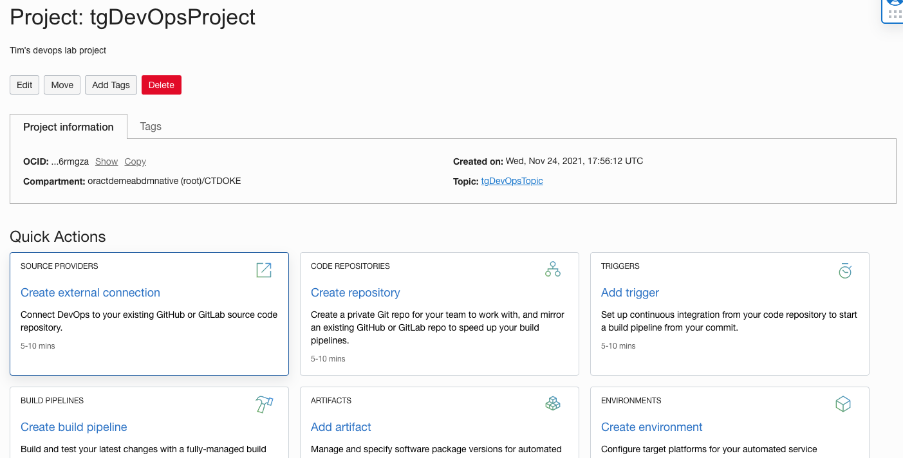

# Creating your DevOps project

## Introduction

A DevOps project is the core starting point for DevOps activities within OCI. Is contains pipelines, information on artifacts and of course an OCI Code repository.

### Objectives

Using the OCI Cloud shell and Browser User Interface we will :

  - Create a Notifications topic used for the DevOps services elements to communicate between themselves
  
  - Create a DevOps project
  
 
### Prerequisites

We've done all the background setup needed for DevOps, and have our Kubernetes cluster running with the Storefront and Stockmanager services in place, so it's time to start creating our DevOps projects.

Our first task it to create a notification service that DevOps will use to communicate progress between it's different elements.

## Task 1: Create the notifications topic used by the DevOps service

  1. Open the OCI Web UI, Go to the notifications service page Click the "Hamburger" menu, chose **Developer Services**, select **Notifications** (In the Application Integration section)
  
  

  2. Confirm you are in the right compartment using the compartment selector on the left, if you're in a free trial this is probably `CTDOKE`, but if you're in a commercial tenancy you may have used something different
  
  
  
  3. Click **Create Topic** top open the create popup
  
  

  4. In the form enter a name of the form `<YOUR INITIALS>DevOpsTopic`, Enter a description of `Communication between DevOps service elements`, Click the **Create** button
  
  

  5. It will take a short while for the topic to be created, once it has you will see it in the topics list
  
  
  
## Task 2: Creating the DevOps Service

Now we can create the DevOps service instance

  1. Navigate to the Dev Ops service, click the "Hamburger" menu select  **Developer Services** select **Overview**
  
  

  2. Click the **Create DevOps Project** button to open the create project form
  
  

  3. Provide a name for your project along the lines of `<YOUR INITIALS>DevOpsProject`, Add a description if you want, Click the **Select Topic** button, this will open a new topic selection popup
  
  
  
  4. In the topic selection popup make sure your compartment is selected and chose your topic (which should be named along the lines of `<YOUR INITIALS>DevOpsTopic`) from the topic dropdown if it's not already selected. Click the **Select Topic** button, the topic selection popup will close
  
  
  
  5. The create project form will update to display the topic you selected, click the **Create project** button
  
  

After a short while the project will be created and you will be at the main page for your newly created project.

  
  
## Task 3: Enable logging in the project

The DevOps services usine the OCI logging service to record ths output it generates during the pipeline runs. This will mean that the build logs are available for use in other tooling.

  1. On the page of your newly created project click the **Enable Log** button which will take you to the log management page
  
  

  2. Click the toggle to enable the log 
  
  
  
  3. In the popup leave all the fields unchanged from the provided defaults and click the **Enable log** button at the bottom. 
  
  
  
  The logs will go through the "Creating" stage to the "Active" state
  
  

  4. Use the "Breadcrumbs" to return to your project home page - just click the project name, in my case that's `tgDevOpsProject`
  
  
  
  Once you are on the project home page you will see that the *Enable logging* warning is no longer there.
  
  
  
## End of the Module, what's next ?

Congratulations, you're now ready to start using your DevOps project.

## Acknowledgements

* **Author** - Tim Graves, Cloud Native Solutions Architect, EMEA OCI Centre of Excellence
* **Last Updated By** - Tim Graves, November 2021
  