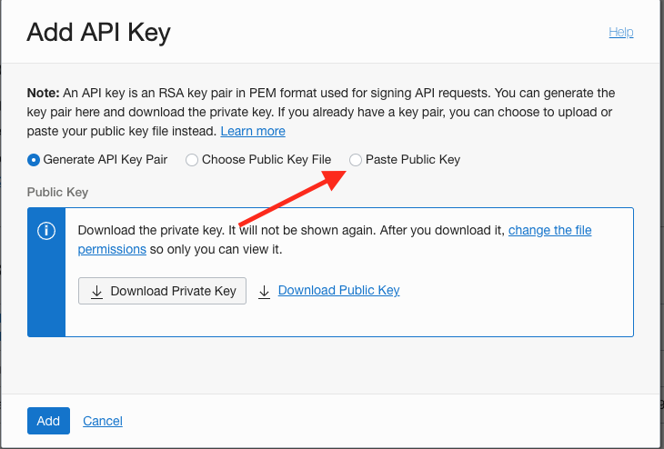
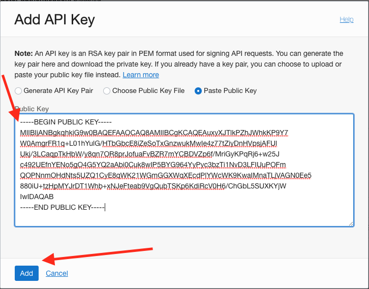
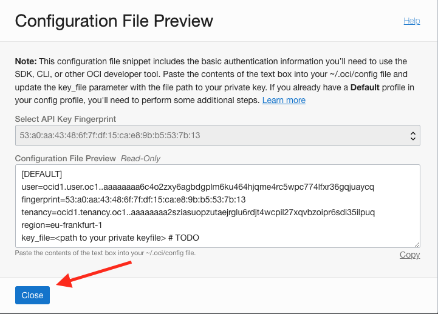

# Configuring a ssh authentication token

## Introduction

One of the ways you can authenticate to access Oracle Cloud Infrastructure services is using a ssh based API Key In this module we will set that up.

If you **already** have an ssh authentication token configured in OCI you can jump down to task 3: Updating your ssh configuration

### Objectives

Using the OCI Cloud shell and Browser User Interface we will :

  - Create an ssh key pair
  
  - Upload the public key to OCI to use as a token
  
  - Configure our ssh environment to use this key when connecting to the OCI Code Repositories we will create later.


## Accessing the OCI Cloud shell

In many places through this lab we will be using the OCI Cloud Shell to provide an environment where we can execute commands. The OCI Cloud Shell is a small Linux based instance you access from the OCI Web Interface and it runs within the OCI environment, already logged in and authenticated as you. This means we don't need to configure your local environment to use the **oci** command, but more importantly it ensures that everyone doing the lab will have an environment to use which has all of the commands we need ready to use.

To open this click the Cloud Shell Icon  you find this at the upper right of any OCI Web Interface screen


The cloud shell will open at the bottom of the screen

You may have a short delay while the OCI infrastructure gets your home directory, creates an instance for you and connects to it, you can see it in the lower part of the page.


Once open you can do normal things like minimize / maximize / restore / close the Cloud Shell using the icons 


### Task 1: Creating an ssh key

To interact with the OCI DevOps Code Repository we will soon be creating we need to authenticate ourselves to OCI using an authentication token, this will be based on your **Users** SSH key. 

**IMPORTANT** The SSH based API authentication we will be doing is not the same as the SSH setup used when accessing a virtual machine using SSH. If you already have setup a SSH key for **User** API access **In the OCI Cloud Shell** then you can skip the following steps and go to the **.ssh/config** session below. If you are doing this lab in a free trial account it is unlikely that you will have configured SSH access.

  1. Go to the OCI Cloud shell

  2. Create the .ssh directory to hold the keys we are about to create.

  - `mkdir -p $HOME/.ssh`
  
  3. Switch to that directory

  - `cd $HOME/.ssh`

Now we can create the keys to use, we are going to do this rather than let the web UI do it as this means we don't have to transfer them over from your computer. Note that if you have already got ssh API keys configured for authentication which were not created in the OCI cloud Shell you can just place them into id_rsa and id_rsa.pub files in this folder (use `cat > id_rsa` and then past the contents then do Control-D to finish the cat). If you prefer to use new keys please do so, but remember than you can only have three API Keys in each account.

  4. Run the following command in the OCI Cloud Shell to create a key pair, when prompted for a pass phrase just press return (a pass phrase can be used to secure access to the generated key, but that requires some additional setup so in the interests of time not going to use that here). Please replace `<email address>` with the email address for your user (for a free tenancy this is usually the one you provided during the sign-up process)

  - `ssh-keygen -t rsa -f $HOME/.ssh/id_rsa -C "<email address>" `

  ```
Generating public/private rsa key pair.
Enter passphrase (empty for no passphrase): 
Enter same passphrase again: 
Your identification has been saved in id_rsa.
Your public key has been saved in id_rsa.pub.
The key fingerprint is:
SHA256:aeAiZrPoYTT3EtPg8Yq2JDvIovLR0syh/wN3RI8em1M tim_graves@4d82c9745b49
The key's randomart image is:
+---[RSA 2048]----+
|                 |
|        .        |
|   . ... o       |
|  . +...+.E      |
| o=Xo..+S=       |
|++oX*.o.*        |
|===S== . .       |
|B *+o .          |
|o+......         |
+----[SHA256]-----+
```

  5. Now we need to get the public part of the key into PEM format so OCI can process it

  - `ssh-keygen -f ~/.ssh/id_rsa.pub -e -m pkcs8`

   ```
-----BEGIN PUBLIC KEY-----
MIIBIjANBgkqhkiG9w0BAQEFAAOCAQ8AMIIBCgKCAQEAxkHgmQxKd2jGBK5m3ym0
p5CnvKye0nkMwmE3vXbEwJwfHF16m+eTjpKxRsu6xZE4r4CHtyMm1cE8Tk9Ud8kI
e5RrslqWlPgQhzla7dmB1PiHvPdP2CXpWz5ijlOVayKZ7/yP3W1AtRoMsAgigfLf
v9Kepvaa+6o5846SAS1KcYBxCmNBTvUCRSBCPXNkydtf2z2t071jQP8ZxBw+Tse2
y4mAl0BXd2zThIYd1imkAh/LBcczE8dSXqZUn2070jpjaFzccpzKNNI7KcB/cQsd
tcl+Vi2ZjhRxBQE7Vtrgzgj15cBeWUEFW+5w4vshgnIpP9V+PvsXDvmY0ZmAht++
xwIDAQAB
-----END PUBLIC KEY-----
```

  6. Copy the resulting text *including the `-----BEGIN PUBLIC KEY-----` and `-----END PUBLIC KEY-----` lines and save it in a note pad or something.

### Task 2: Adding the key to your account

Let's set this up as an API key in your account.

  1. Navigate to your user details page
  
  - Click the "Shadow person" on the upper right
  
  
  
  - In the resulting menu click on your user name to get to your user details page this images shows my username, yours of course will be different.
  
  
  
This will open your user details page.

  

  2. Go your API Key details

  - On the left side Under `Resoures` click  `API Keys` - You may need to scroll down the page a little to see this.
  
  
  
This will show the **API Keys** view of your user profile.

  

Depending on what other work you have done in your account you may have between zero and three keys listed, in this case I have one.

Provided you have less than three API keys listed you can proceed with adding your new key, if you do have three keys then you will either have to delete an existing key, or locate the private key that matches one of the existing keys.

  3. Add the API key to your profile

  - Click the **Add API Key** button
  
  
  
This will open the **Add a key** popup

  - Click **Paste public key**
  
  
  
The UI will change slightly to provide a text box

  - Copy the **entire** output we just got above **including** the Begin and End lines into the box

  - Click the **Add** button
  
  
  
The UI will update to show a confirmation box, in this case we will be using the key we just added with ssh, do we don;t need to use the configuration information it's presenting.

  - Click the **Close** button
  
  

The UI will update to show the summary info for the newly added key.

  
  
### Task 3: Updating your ssh confguration

Next we need to setup our SSH configuration file, to do that we need to get some further information.

  1. Getting your username

  - Click the "Shadow person" Icon, but this time just display the menu
  
  

  - Locate and copy the user name from the top of the user details page we're still on, in my case that's `oracleidentitycloudservice/tim.graves@oracle.com` (as I'm using an account with a federated identity the name of the identity system is also part of my user name) but for users in a non federated system (which will be most free trial users) that's going to be just the user name you used when creating the account.
  
  

  - Locate your tenancy information if you click the little "shaddow person" you can see that, in may case it's `oractdemeadbmnative`, though of course yours will vary, for a free trial account it's often based on the name you gave when setting up the account.
  
  
  
  - Open the cloud shell and using your preferred editor edit the file `$HOME/.ssh/config` (vim, vi, emacs and nano are available, there may be others)

  - Add the following details, substitute your username and tenancy name which you just retrieved
```
Host devops.scmservice.*.oci.oraclecloud.com
  User <your username>@<tenancy name>
  IdentityFile ~/.ssh/id_rsa
```

As an example mine looks like this - but yours of course will differ

```
Host devops.scmservice.*.oci.oraclecloud.com
  User oracleidentitycloudservice/tim.graves@oracle.com@oractdemeadbmnative
  IdentityFile ~/.ssh/id_rsa
```

## End of the Module, what's next ?

Congratulations, you're now ready to use ssh keys to access OCI services

Your next step is to configure the security groups and policies in OCI

## Acknowledgements

* **Author** - Tim Graves, Cloud Native Solutions Architect, EMEA OCI Centre of Excellence
* **Last Updated By** - Tim Graves, November 2021
