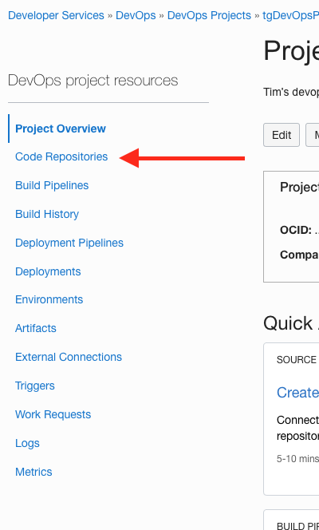
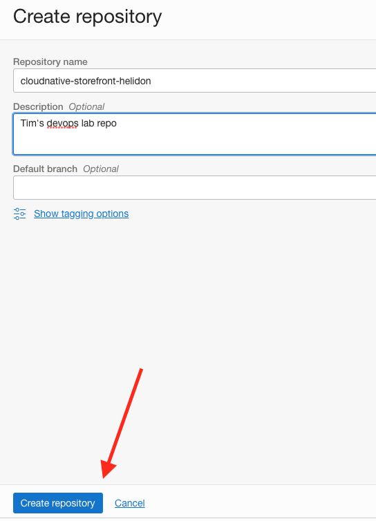
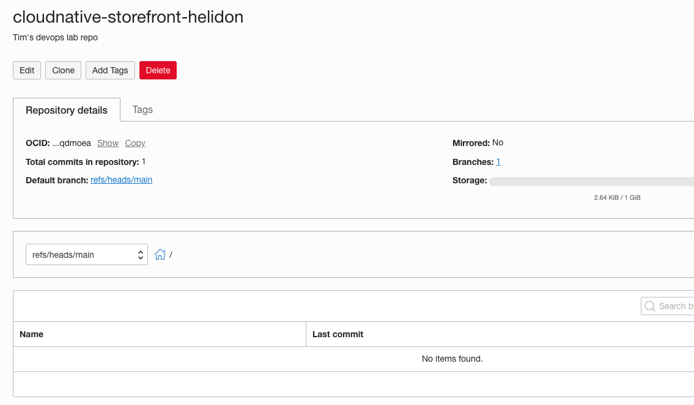
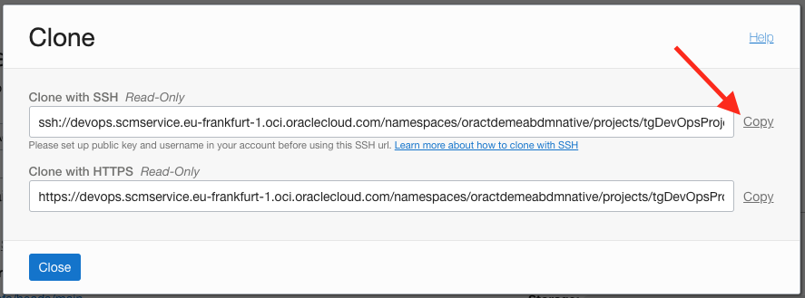
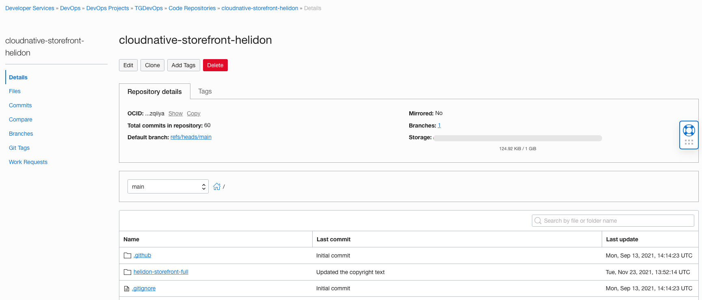
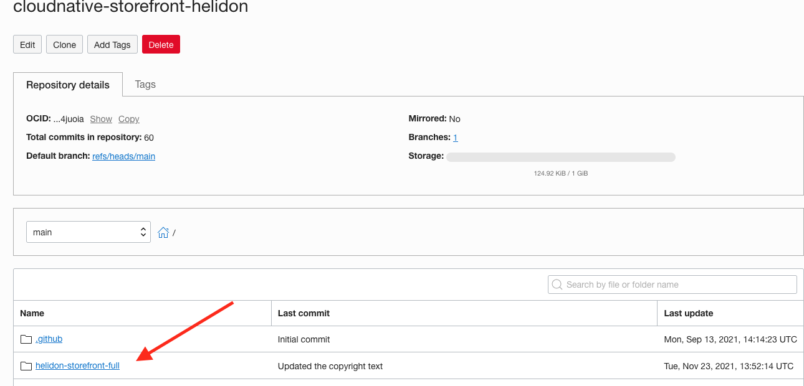
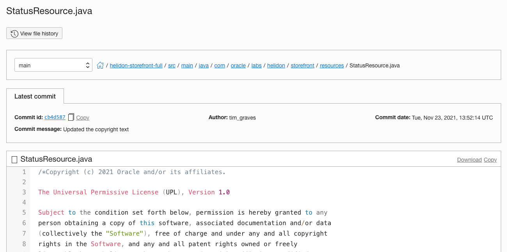
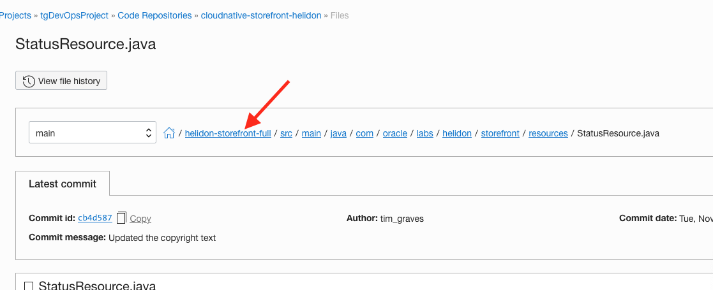

# DevOps Lab Git repo Setup

## Introduction

We need a git repo to work with. There are many ways we can work with git in the DevOps service, we could use a repo in github or gitlab directly or create a OCI Code repo (basically a git repo) inside your project which is an automatically updating a mirror of an external git repo on gitlab or github. You could even create your own separate copy of the origional rep in github, but for all of these options you would need to have a github account and also a personal access token and that complicates things (and keeping up with changes to the OCI web UI is hard enough, having to keep up with github / gitlab changes as well would make it difficult to keep this lab up to date.

For this lab we are going to take the different approach where every one has a Git repo (officially here an OCI Code repo) in their own project, that way you can easily update it without having conflichts with other users - and I don't have to worry about trying to push changes into my main repo holding the demo code !

### Objectives

Using the OCI Cloud shell and Browser User Interface we will :

  - Create a git repo in your devops project.

  - Use git to transfer the sample project from github to the OCI Cloud Shell environment
  
  - Use Git to upload the sample code to the OCI Code repo in your devops project
  
  - Have a look at the code in the OCI Code Repo
  
 
### Prerequisites

You've done all the background setup needed for DevOps (Creating Vaults, ssh API Keys, security groups and policies). Have our Kubernetes cluster running with the Storefront and Stockmanager services in place, and have created your DevOps project.

## Task 1: Creating the git repo in your Devops Project

To start with we're going to create a the OCI Code repo in your project.

  1. If you are not already there navigate to your DevOps project home page. 
  
<details><summary><b>How to get to your DevOps project home page</b></summary>

  - Go to the DevOps service home page - click the "Hamburger" menu select  **Developer Services** select **Projects**
  
  
  
  You will see a list of projects

  

  - Click on your project name in the list, in my case that's `tgDevOpsProject` but yours may vary, you will be taken to your projects home page
  
  

---
</details>  


  2. On the left side of the project page click on the **Code Repositories** link
  
  

  3. Click on the **Create repository** button, this will open the **Create repository** popup
  
  

  4. Name the repository `cloudnative-storefront-helidon`, Provide a description if you like, but leave the default branch name blank (it will be set to `main`). Click the **Create repository** button
  
  

  It will take a short while to create the repository, then you will be taken to it's home page
  
  
  
## Task 2: Populating your cloud shell code repo

Now we are going download the original repo with the source code for this lab into the OCI cloud shell. We are using the OCI Cloud shell because it has all of the commands we need to do this lab, so you don't need to setup anything on your laptop, we can even make changes to the source code to demonstrate that the pipelines do deploy them! In a production environment of course you'd use your own development systems.

First we are going to download the origional repo from github. This is a public repo so you don't need a github account.

  1. Open the OCI Cloud Shell, if you are not already there go to your home directory
  
  - `cd $HOME`

  2. Use git to download the sample code

  - `git clone https://github.com/oracle-devrel/cloudnative-helidon-storefront.git`
  
  ```
  Cloning into 'cloudnative-helidon-storefront'...
remote: Enumerating objects: 542, done.
remote: Counting objects: 100% (542/542), done.
remote: Compressing objects: 100% (244/244), done.
remote: Total 542 (delta 271), reused 496 (delta 234), pack-reused 0
Receiving objects: 100% (542/542), 104.42 KiB | 0 bytes/s, done.
Resolving deltas: 100% (271/271), done.
```

The precise details will vary as we update the lab, btu you shoudl see somethign like this.

  3. This will create a folder called `cloudnative-helidon-storefront` in your home directory, switch to it

  - `cd cloudnative-helidon-storefront`

  4. We need to tell git who we are so it can track who makes changes, run the commands below replacing `<your email` and `<your name>` you can use anything you want here as this is just a lab, but in a real project you'd use your real email and name. Both of these two commands just return without any output.

  - `git config  user.email "<your email>"`
  
  - `git config user.name "<your name>"`
  
We are only setting these for this specific project, do don't worry, doing this will not effect any other git projects you have in the OCI Cloud Shell

## Task 2: Updating your local git configuration information

Git operates on the idea of branches, like a tree, there is the `main` branch and then the sub branches. Each branch has it's own view of the file structure based on what the parent branch looked like when the sub-branch was created It's regarded as good practice to do your development in a sub branch and make sure it's all working fine before merging your changes into the `main` branch, usually with some form of review and approval process.  This is a simplistic description, but for the purposes of this lab it covers what you need to know, there are **lots** of places on the web and published books where you can get more details if you want.

We need to tell git where the OCI Code repo is in your project. For this to work you **must** have setup ssh keys in your account and updated the .ssh/config file as described in the ssh setup step.

switch to the right branch (ONLY NEEDED RIGHT NOW, in the finished lab I'll have committed initial-code-added into the main branch)
git checkout initial-code-added

  1. In the OCI Code Repository page for your newly created repo  page click the **Clone** button to open the clone popup
  
  
  
  2. In the clone popup to the right of the **Clone with SSH** field click the `Copy` link to get the path to access the repo with git. Save this information somewhere
  
  

  3. We are now going to create a connection to the OCI Code Repository you created, this will be called `devops`. In the OCI Cloud shell type the following, replacing `<SSH PATH>` with the ssh details you just copied
  
  - `git remote add devops <SSH PATH>`
  
This command will just return and won't generate any output

  4. For saftey remove the connection to the original repo in github - you shouldn't be able to push to this anyway, but it will prevent me getting lot's of pull requests !

  - `git remote remove origin`
  
  5. Let's confirm we've made the changes

  - `git remote`
  
  ```
  devops
  ```
 The output should only contain `devops`
 

## Task 3: Uploading form your OCI git repo to your projects OCI Code repo

We're now ready to upload the contents of our local repo to the OCI Code repo you created in your DevOps project

  1. Make sure we're "up to date" with our OCI code repo (it's created with some existing content) 
  

  
  - `git pull --no-edit devops main`
  
  ```
  FIPS mode initialized
warning: no common commits
remote: Counting objects: 2, done
remote: Finding sources: 100% (2/2)
remote: Getting sizes: 100% (1/1)
remote: Total 2 (delta 0), reused 2 (delta 0)
Unpacking objects: 100% (2/2), done.
From ssh://devops.scmservice.eu-frankfurt-1.oci.oraclecloud.com/namespaces/oraseemeatechse/projects/TGDevOps/repositories/cloudnative-storefront-helidon
 * branch            main       -> FETCH_HEAD
Already up-to-date!
Merge made by the 'recursive' strategy.
```

<details><summary><b>What's the --no-edit option ?</b></summary>

The --no-edit option just tells git to use default text when combining the content, this means you don't need to provide text explaining why you're doing this. Normally that's a bad idea as providing a history trail in git is important, but here we're just setting things up so it's fine

---
</details>

  2. Now let's push our active branch to the repo, you may be asked to confirm you want to upload (You get a message "The authenticity of host..." as below) then enter `yes`

  - `git push devops main`
  
   ```
FIPS mode initialized
The authenticity of host 'devops.scmservice.eu-frankfurt-1.oci.oraclecloud.com (147.154.159.40)' can't be established.
RSA key fingerprint is SHA256:fwLRv5ojwvj3htlkB8VnMqU/8a6x9YXsTT1pFKiu/2c.
RSA key fingerprint is SHA1:YFX2kIUoZYJ1y0SSn1E+MmCOPiE.
Are you sure you want to continue connecting (yes/no)? yes
Warning: Permanently added 'devops.scmservice.eu-frankfurt-1.oci.oraclecloud.com,147.154.159.40' (RSA) to the list of known hosts.
Counting objects: 544, done.
Delta compression using up to 2 threads.
Compressing objects: 100% (208/208), done.
Writing objects: 100% (543/543), 104.71 KiB | 0 bytes/s, done.
Total 543 (delta 271), reused 542 (delta 271)
remote: Resolving deltas: 100% (271/271)
To ssh://devops.scmservice.eu-frankfurt-1.oci.oraclecloud.com/namespaces/oraseemeatechse/projects/TGDevOps/repositories/cloudnative-storefront-helidon
   83da6f7..17b624d  main -> main
```

  8. If you have not already done so you can now close the Clone repo popup by clicking the **Close** button
  
  
  
  9. The OCI code repo has now updated, you can see that is has now got a number of commits, and also files. Note that you may need to return to your Code Repositories list (use the "Breadcrumbs" and then back into your code repo) for the files list to update.
  
  

## Task 4: Exploring our code

Let's have a look at the state of our projects OCI code repository. From the Code repository home page we can see the root code of the project

  1. Click on the `helidon-storefront-full` directory name in the repository contents, this will move us through the hierarchy to that directory.
  
  

  2. We can see the files in the `helidon-storefront-full`, following the links continue to navigate to `src/main/java/com/oracle/labs/helidon/storefront/resources`
  
  

  3. Click on the StaturResource.java this will open the source code file in the viewer
  
  
  
  
  4. This is a simple file, scoll down past the copyright (Sorry, but Oracle require that's there) and if you have done the Helidon labs you will see that it's the code that is run when  the `/status` REST API is called, Note the line

```java
public final static String VERSION = "0.0.1";
```

  This is the version string that is returned when we call the `/status` end point, and as we go through the lab it's what we will be changing to show the CI/CD process has worked.

Feel free to look at the other files in the repo if you wish.

  5. Using the path "breadcrumb" at the top of the code display return to the `helidon-storefront-full` directory

  


## End of the Module, what's next ?

Congratulations, you've added the sample content to your OCI Code repo.

## Acknowledgements

* **Author** - Tim Graves, Cloud Native Solutions Architect, EMEA OCI Centre of Excellence
* **Last Updated By** - Tim Graves, November 2021