# Setting up your Development VM core 

## Introduction

The following instructions are for the January 2022 version of the virtual machine image in the market place which we are in the prtocess of publishing. for the October 2020 version please [follow the instructions at this link](https://github.com/oracle/cloudtestdrive/tree/master/AppDev/cloud-native/scripted-setup/helidon-vm-setup-2020.md)

**Estimated module duration** 15 mins.

### Objectives

This module takes you through the process of creating and configuring up a virtual machine in your tenancy for the lab. It assumes you have run the core OCI setup (which creates compartments and databases for you).

### Prerequisites

You need to an Oracle Cloud tenancy, with either full admin rights (For example a trial tenancy) **OR** if you have a tenancy but not full admin rights you need a existing compartment (ideally called `CTDOKE` to match the instructions) with full admin rights in that compartment.


## Setup needed

In most cases you will need to do all of the following steps, however **if you are attending an instructor-led lab**, your instructor may have been able to arrange to have some steps complete to speed the lab up, if so they will detail steps you need to execute and which ones you can skip.

While we strongly recommend running the lab in the virtual machine we have built, running on the Oracle Cloud Infrastructure, if you do not want to use this VM and are willing and able to re-create the configuration of the virtual machine on your own computer (and adjust the labs content to reflect your differing environment as you go through it) there are some guidelines [here](https://github.com/oracle/cloudtestdrive/blob/master/AppDev/cloud-native/manual-setup/using-your-own-computer.md)

<details><summary><b>Self guided student - section video introduction</b></summary>

This video is an introduction to this section of the lab. Once you've watched it please press the "Back" button on your browser to return to the labs.

[](https://youtu.be/fxrOnJjCLBc "Lab preparation introduction video")

---

</details>


## Task 1: Creating the basic VM

This assumes that you already have setup compartments, databases and provided configuration information to OCI.

If you are in an **instructor led lab** the instructor may have already done this step for you, if so they will tell you.

### Step 1a: Accessing the marketplace
  
  1. Open the Cloud Marketplace URL  https://cloudmarketplace.oracle.com/marketplace/listing/86865043 in a new web browser tab / window.
  
  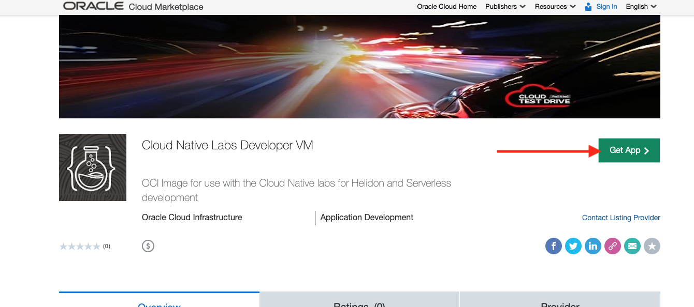
  
  2. Click the **Get App** button
  
  3. In the Install Application page chose the region you are using
 
  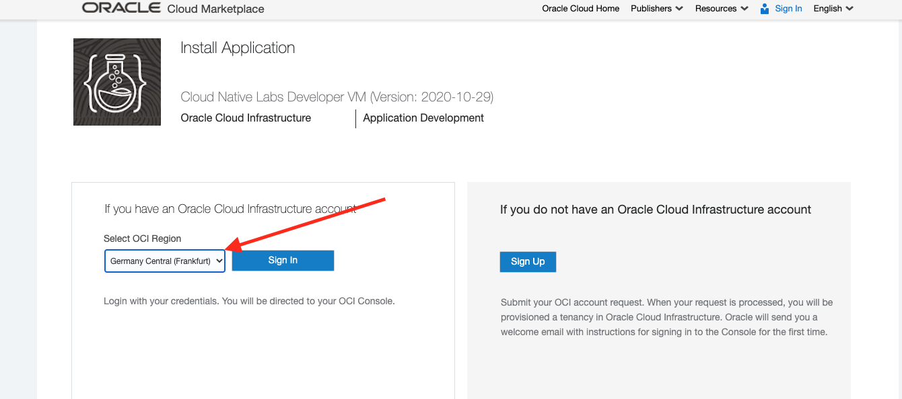

I chose Frankfurt, but yours may vary

<details><summary><b>If you don't know your region</b></summary>

In your OCI Console UI page look at the upper right, you will see something like this


In this case for my tenancy I'm in the Germany / Frankfurt region, but if you are using a different region it will show up there.

</details>

  4. Click the **Sign in** button
  
  5. If prompted complete your OCI Cloud UI sign in, if you are not prompted do not worry.
  
  6. In the Marketplace install page make sure that the **Version** matches the Version in the Image location file (In this image that's 2020-10-29, but if we have released an updated image then the version will be more recent.)
  
  7. Make sure that the **Compartment** matches the compartment you are using (probabaly `CTDOKE`)
  
  8. Review the "Oracle Standard Terms and Restrictions", then (assuming you do agree) click the **I have reviewed and accept the Oracle Standard Terms and Restrictions.** check box.
  
  9. Once you've clicked the checkbox the **Launch Instance** button will be enabled. Click it.
  
  A new browser window / tab may be opened
  
### Step 1b: Creating your VM instance
  
  1. Name the instance based on the image version so you can track what version of the lab you are following. If multiple people are sharing the same tennacy you may want to put your initials in there as well e.g. `H-K8S-Lab-A-Helidon-2020-29-10-tg`
  
  2. The **Create in compartment** should already be set to `CTDOKE`.

  3. Expand the **Configure placement and hardware** selection if it's not visible

  4. Select an **Availability domain** (Which one doesn't matter)

  5. If `VM.Standard.E4.Flex`  or `VM.Standard.E3.Flex` with 1 OCPU and 16GB memory is not the selected instance shape click the **Change shape** button, set the Instance type to **Virtual machine**, the Processor to **AMD Rome** and the OCPU count to `1` (This will set the memory for you) Then click **Select shape** to use this shape. (You can chose other shapes if you prefer, just at the time of writing this was the most cost effective)

  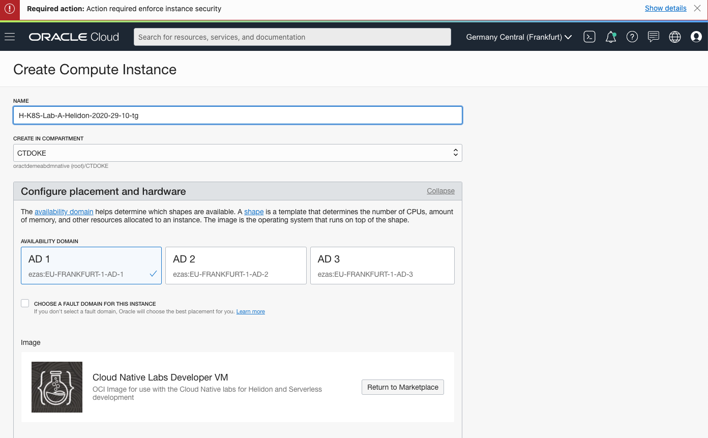
  
  6. Expand the **Configure networking** section if it's not already expanded
  
  7. Select the **Create New Virtual Cloud Network** option
  
  8. Name the network to match the name you gave to the instance 
  
  9. Select the **Create new public subnet** option. (You can ignore the subnet name)
  
  10. Set **both** the **Create in compartment** fields to `CTDOKE`

  11. Check the **Assign a public IP address** option is selected
  
  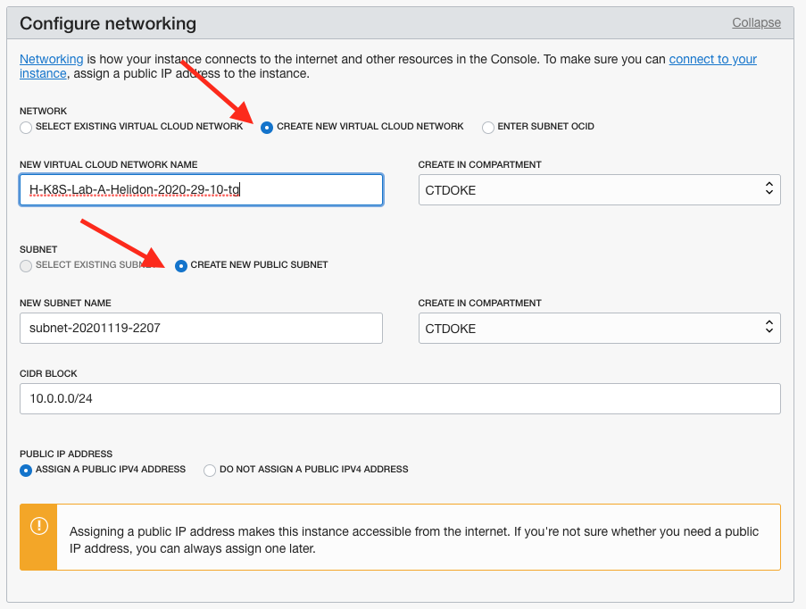

  12. Scroll down to the **Add SSH Key** section

  13. Make sure the **Generate SSH Key Pair** option is selected

  14. If you wish you can download the ssh keys by clicking on the buttons (This is not required as we will be using VNC to access the instance)
  
  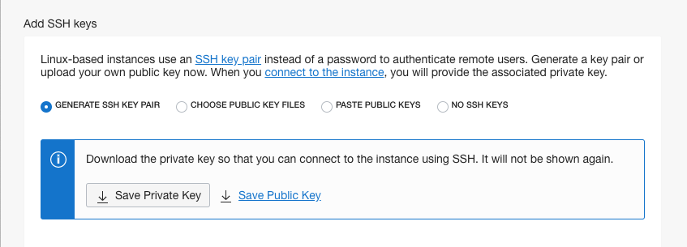
  
  15. Leave the boot volume settings unchanged (On some newer versions of the UI this may be below the SSH keys section, but you still don't change it)
  
You have finished the wizard!

  16. Click the **Create** button on the bottom of the wizard to initiate the creation.

  17. If you get a **No SSH Access** warning you can ignore it, just click **Yes, Create Instance Anyway**

Once the create button has been clicked you will see the VM details page.  Initially the state will be **Provisioning** but after a few minutes it will switch to **Running**, and you will see that a **public IP address** has been assigned.  Make a note of that IP address (The copy link next to it will copy the address into your computers copy-and-paste buffer.)

  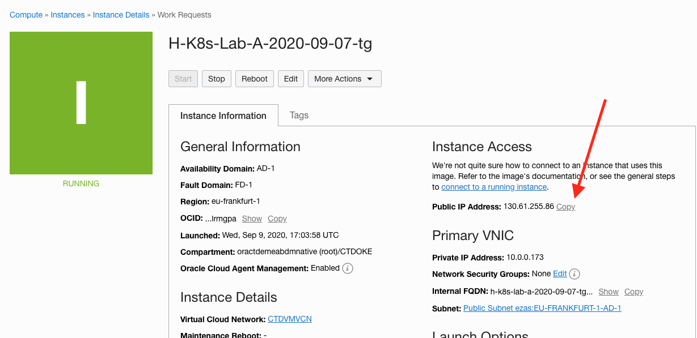

While it's starting you can work on the next step  

## Step 2: Adding an OCI ingress rule for VNC

If you are in an **instructor led lab** the instructor may have already done this step for you, if so they will tell you.

You need to be sure that the Virtual Cloud Network supports remote access using VNC.

  1. Go to the VCN you created earlier, click the VCN name in the instance details page, I named mine `H-K8S-Lab-A-Helidon-2020-29-10-tg`
  
  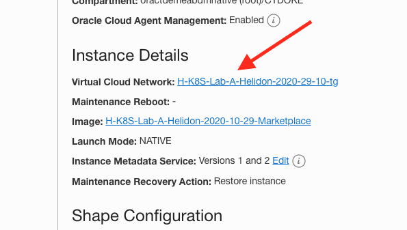

  2. On the VNC page on the left hand side click the **Security Lists** option

  3. Click on the security list in the list, If there is more than one chose the one with a name something like `Default Security List for H-K8S-Lab-A-Helidon-2020-29-10-tg` (don't select the private subnet one if it's there)
  
  

  4. In the security list page click the **Add Ingress Rules** button
  
  An "Add Ingress Rules" popup will be dieplayed

  5. Leave the **Stateless** option unchecked (This will provide for the returning traffic)

  6. Leave the **SOURCE TYPE** as `CIDR`

  7. In the **SOURCE CIDR** enter `0.0.0.0/0` (basically the entire internet, in a production you might limit to your organizations address range)

  8. Leave the **Protocol** as `TCP`

  9. Leave the **SOURCE PORT RANGE** blank

  10. Set the **DESTINATION PORT RANGE** as `5800-5910`

  11. Set the **DESCRIPTION** to be `VNC`

  12. Click the **Add Ingress Rules** button

  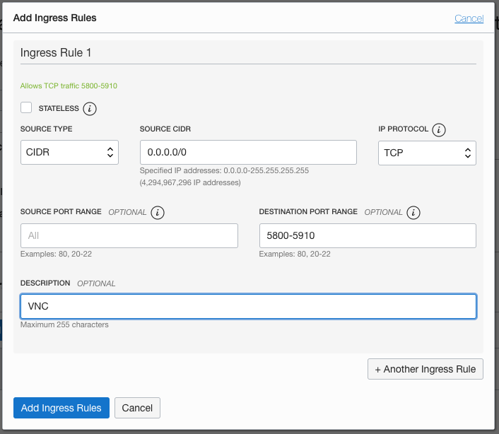


## Step 3: Accessing the Developer VM

Access to the Developer VM is via a VNC client, this allows us to provide direct access to the desktop and enables easy use of the developer tools. If you do not already have a VNC client on your computer you will need to install one.

### Step 3a: Installing a VNC client in your computer

There are multiple possible clients, chose from the list below or use another if you already have it. Note that the following may require you to have some level of admin rights on your machine.

#### Installing a VNC viewer on MacOS

For **macOS** we recommend realVNC which can be obtained from 

  - https://www.realvnc.com/en/connect/download/viewer/macos/
  
#### Installing a VNC viewer on Windows

For **Windows**, suggested packages are TigerVNC viewer or TightVNC Viewer but if you already have a preferred VNC viewer you can use this. TigerVNC viewer has a simpler install process, as it is a standalone executable, but has fewer features.

  TigerVNC: Download the relevant installer from your computer from

  - `https://sourceforge.net/projects/tigervnc/` and save it to your desktop. It is a self-contained executable file, which requires no further installation.

 TightVNC Viewer: Select the 'Installer for Windows (64-bit)' from

  - `https://www.tightvnc.com/download.php`

  - When prompted, select to save the file.  Next, run the executable to install the program. This requires you have the privileges to install software on your machine

### Step 3b: Accessing your Development VM using VNC

We are using VNC to provide you with a remote desktop, this let's us use a Integrated Development Environment for the Helidon labs.

You need to let your VM run for a couple of mins to fully boot and start the VNC server.

  1. Open your VNC Client

  2. Connect to the client VM. Depending on your client you may be asked to different information, but usually you'll be asked for a connect string. This may look like `123.456.789.123:1` where the `123.456.789.123` is the IP address and the `:1` is the display number. Some VNC clients require the use of the port number in which case it will be `123.456.789.123:5901` where the `123.456.789.123` is the IP address and the `:5901` is the port number. Unfortunately this is client specific, so if one approach doesn't work try the other. Note that is an example connection, you will need to use the IP address of your VM.

  3. You VNC client may warn you that you're making an insecure connection, this is expected as we have not setup security certificates. For example for a real VNC client on a Mac this may look like 

  

  4. You will be asked to enter a password to access the virtual screen. The initial VNC login password is : `Atp--101` (that's Atp hyphen hyphen one zero one). This is an example showing this with the Real VNC client running on a Mac

  

Once you have logged in you will see the Linux desktop, it will look similar to this, though the background and specific icons may differ.

  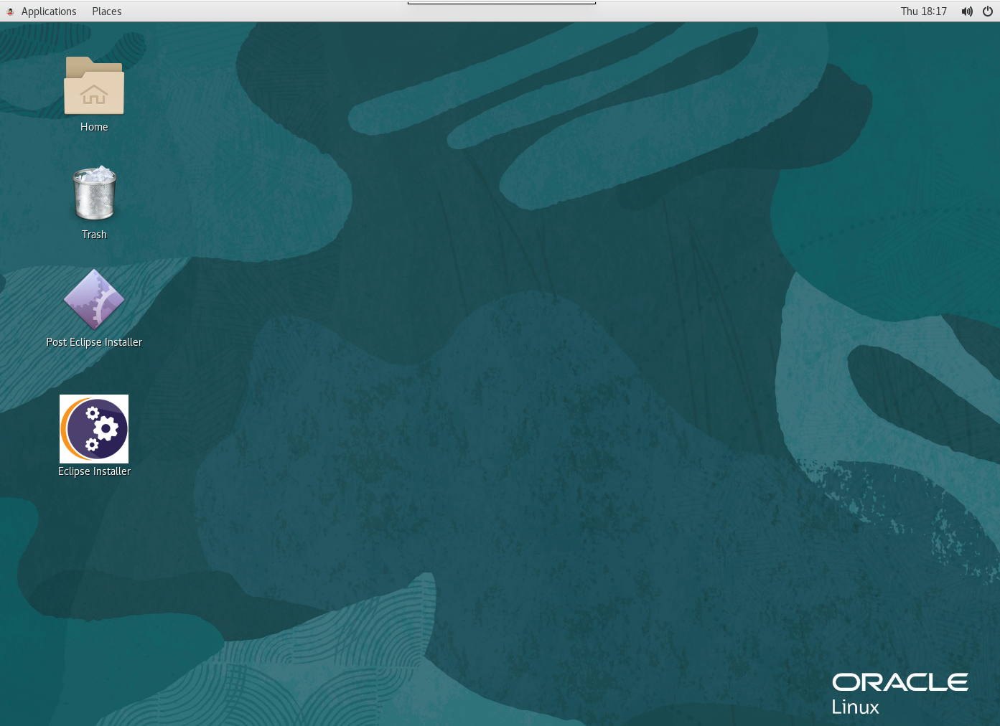
  
### Step 3c: Opening a terminal

For a number of the following steps you will need to open a terminal, if you already have a terminal open you can just re-use it, if you don't then the following steps will help you open a new terminal.

  1. Click on the **Activities** menu on the upper left of the VNC screen
  
  2. A activity selection menu will appear with commonly used activities, click on the Terminal icon
  
  
  
  3. A terminal will appear on the desktop.
  
  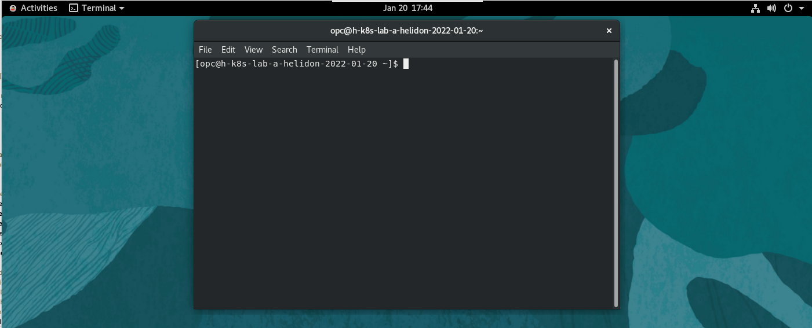
  
#### Accessing an existing terminal or other application
  
  If you have lost an application, for example a terminbal window is hiding behind a web browser then you can go back to the application using the activities menu
  
  Click the **Activities** menu option on the upper left
  
  The screen will display the activity selection menu on the left, but images for any existing applications will also be shown, just click on the image of the application you want to switch to it's window
  
  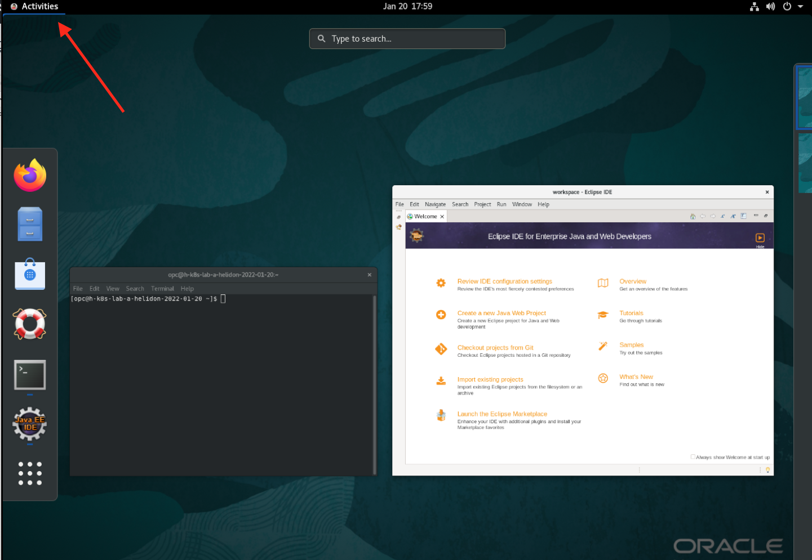

### Step 3e: Changing the VNC Password (optional)

We have provided a pre-set VNC password. If you are in a instructor led lab this may have been provided to you by your lab instructor, or it may be in the image location file you downloaded earlier.

While not required we do recommend that you change this password to prevent access by other people, this is especially important if you plan on leaving the VM running for a while.

  1. Open a terminal window following the instructions above

  2. In the terminal window type `vncpasswd`

  3. At first the prompt enter your new VNC password

  4. At second the prompt reenter your new VNC password

  5. When prompted if you want a view only password enter `n`

  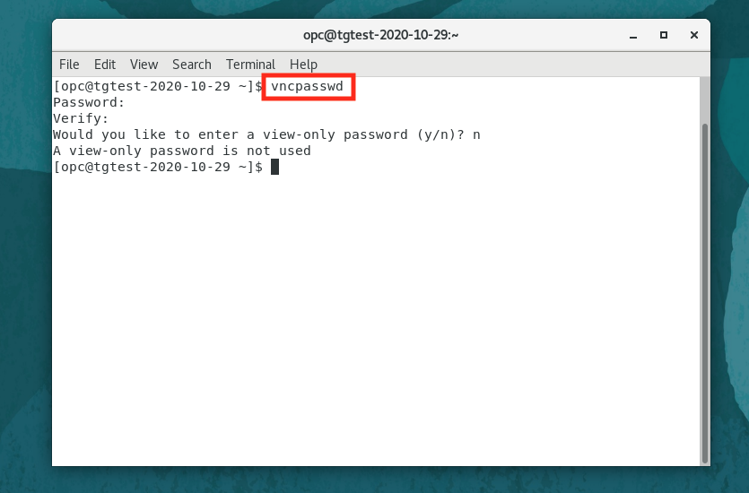

The easiest way to apply the new password is to reboot the VM

  6. In the terminal enter `sudo reboot`

  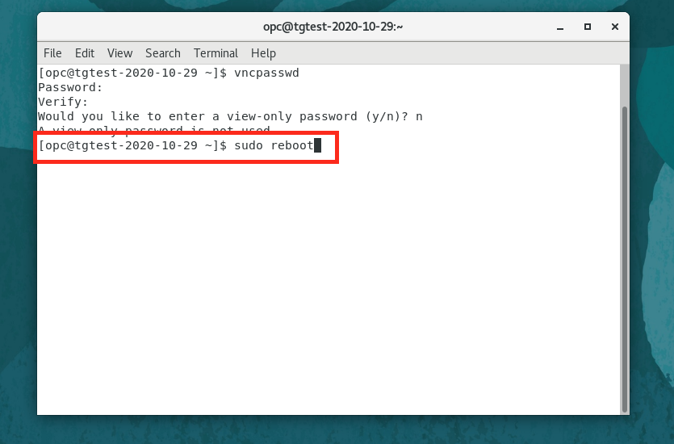

The VNC connection will probably drop immediately and the VNC client will try to reconnect (in which case close the VNC window) or it may just close the window for you (the specific behavior is VNC client specific.) 

When the VM has rebooted (allow about 60 - 90 seconds) Open a new VNC connection, the IP address should remain the same, and at the VNC login enter the **new** VNC password you just set.

## Step 4: Installing Eclipse in the developer VM

We have installed a developer configuration of Oracle Linux, and added tools like Maven, git and the Java development kit. To ensure that you have the latest integrated developer environments (IDE's) and starting point source code for the labs there are a couple of steps you need to take.

There are many IDE's available. We have chosen Eclipse as it's open source licensed. As Eclipse requires the acceptance of a license we can't automate the process for you.

### Step 4a: Downloading Eclipse

We have installed the Eclipse installer and placed is in a folder on your home directory.  

  1. Open the File manager by clicking on the **Activities** menu on the upper left of the VNC window, then the Filling cabinet icon
 
  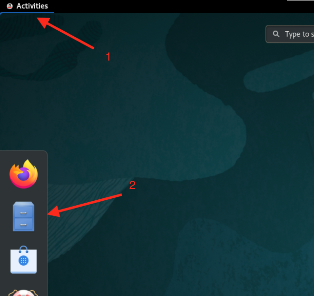
  
  2. The file manager will start, open the **eclipse-installer** folder by double clicking on it, note that the exact location in the window may vary
  
  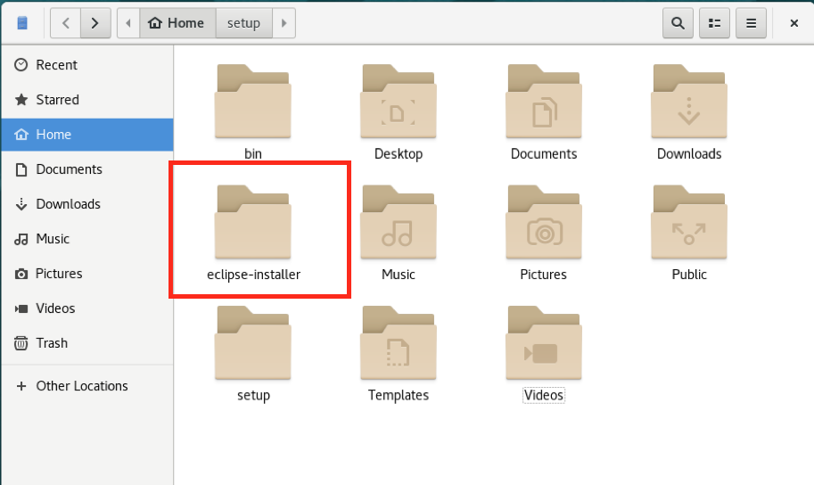
  
  3. Start the Eclipse installer by double clicking on the **eclipse-inst** icon, note that the exact location in the window may vary. **DO NOT** click on the .ini file
  
  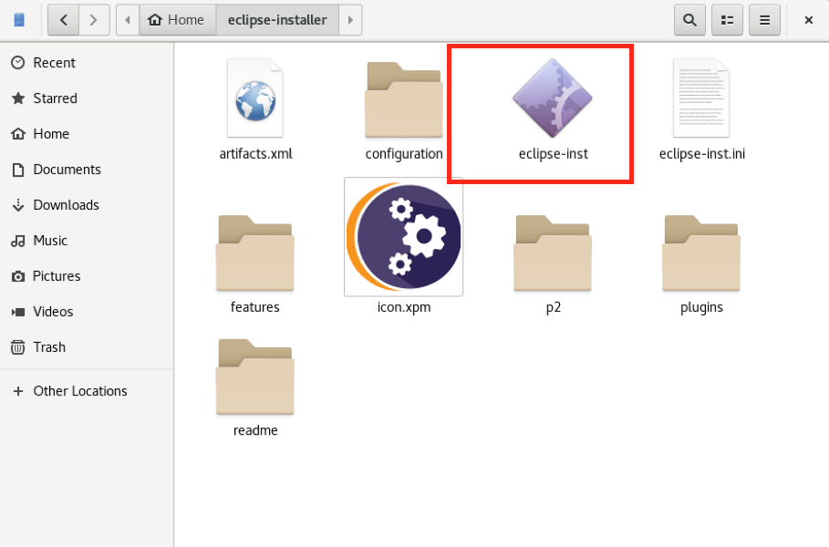

The Eclipse installer will start.

  4. Select the **Eclipse IDE for Enterprise Java Developers** option

  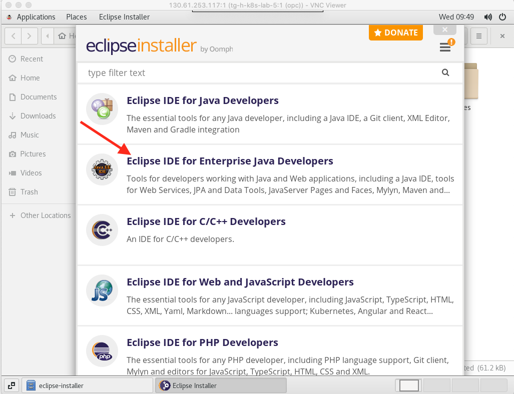

The installer switched to the next page

  5. In the **Java JVM dropdown** Select the `/usr/lib/jvm/java-11-openjdk`  ** DO NOT PRESS INSTALL YET**
 
  6. Set the **Install Path** to be `/home/opc`
  
  (It's really important that you do this, otherwise you'll have to manually setup a lot of the following)

  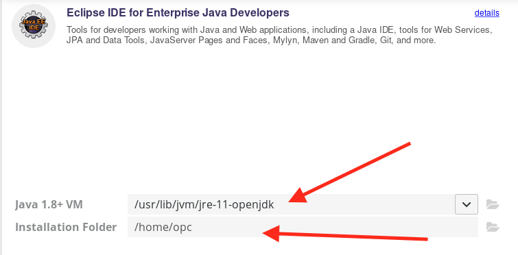
 
  7. Then click the **Install** button
 
  8. Assuming you agree with it click **Accept Now** on the license page. (If you don't agree with the license you can install your own IDE but all of the instructions are on the basis of using Eclipse.)
 
  
 
The installer progress will be displayed
 
  
 
  9. You **may** be presented with warnings about unsigned content, if you are click the **Accept** button
 
  
 
  10. You **may** be presented with warnings about certificates. If you are click the **Select All** button, then the **Accept Selected** button (this is not enabled until certificates have been selected)
  
  
  
  11. On completion close the installer window (X on the upper right.) **Do not** click the Launch button.
 
  

  12. Click **No** on the exit launcher page that's displayed to confirm you do not want to launch Eclipse at this point.

  
  
### Step 4b: Configuring post Eclipse install

To enable us to update the labs without having to update the Developer VM image each time we hold the setup code in a git repository (where we can update it as the lab is enhanced) You need to download this into your development VM and run the setup script.

  1. In the VM Open a terminal or reuse an existing one if you have one already open
  
  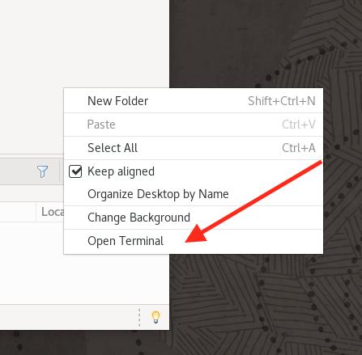
  
  2. If you are reusing a termnal make sure you are in your home directory by typing
  
  - `cd`
  
  3. In the terminal execute the following command to download the latest setup
  
  - `git clone https://github.com/CloudTestDrive/cloud-native-setup.git`

  ```
Cloning into 'cloud-native-setup'...
remote: Enumerating objects: 88, done.
remote: Counting objects: 100% (88/88), done.
remote: Compressing objects: 100% (52/52), done.
remote: Total 88 (delta 22), reused 76 (delta 16), pack-reused 0
Unpacking objects: 100% (88/88), done.
```
  
  4. Run the setup script
  
  - `bash $HOME/cloud-native-setup/cloud-native-setup/scripts/setup/downloadedSetup.sh`
  
  ```
Running post eclipse scripts
Running Lombok Installer
Getting latest version of Lombok
--2020-11-26 18:11:41--  https://projectlombok.org/downloads/lombok.jar
Resolving projectlombok.org (projectlombok.org)... 184.72.218.95
Connecting to projectlombok.org (projectlombok.org)|184.72.218.95|:443... connected.
HTTP request sent, awaiting response... 200 OK
Length: 1914266 (1.8M) [application/java-archive]
Saving to: \u2018lombok.jar\u2019

100%[======================================>] 1,914,266   2.72MB/s   in 0.7s   

2020-11-26 18:11:42 (2.72 MB/s) - \u2018lombok.jar\u2019 saved [1914266/1914266]

Installing Lombok
Configuring Eclipse to use lombok
Running maven repo init process
Cleaning maven environment, compiling and running test program
[INFO] Scanning for projects...
Downloading from central: https://repo.maven.apache.org/maven2/org/codehaus/mojo/exec-maven-plugin/3.0.0/exec-maven-plugin-3.0.0.pom
.
.
.
Lots of Maven Output
.
.
.
Downloaded from central: https://repo.maven.apache.org/maven2/commons-codec/commons-codec/1.11/commons-codec-1.11.jar (335 kB at 805 kB/s)
LombokHelloWorld(hello=World)
[INFO] ------------------------------------------------------------------------
[INFO] BUILD SUCCESS
[INFO] ------------------------------------------------------------------------
[INFO] Total time:  10.692 s
[INFO] Finished at: 2020-11-26T18:11:54Z
[INFO] ------------------------------------------------------------------------
```

  5. Once the script has completed (this may take a few mins) then close the terminal window.

### Step 4c: Starting Eclipse for the first time

The first tine you start Eclipse there are some additional steps to take, but if you ever need to restart it you just need to follow steps 1., 2. & 3.

  1. Click on the **Activities** menu on the upper left of the session
  
  2. Select the application grid in the menu
  
  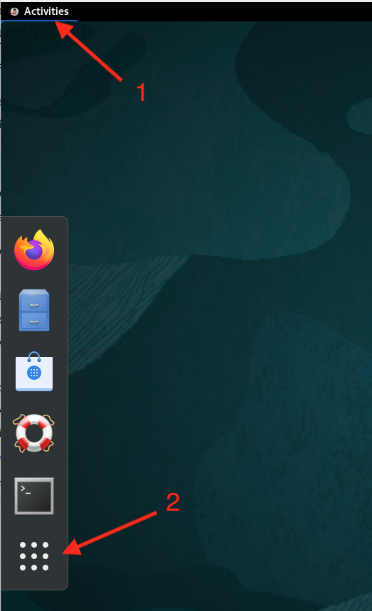
  
  3. In the applications grid that is now displayed click the Eclipse icon, note that it's location in the grid may vary
  
  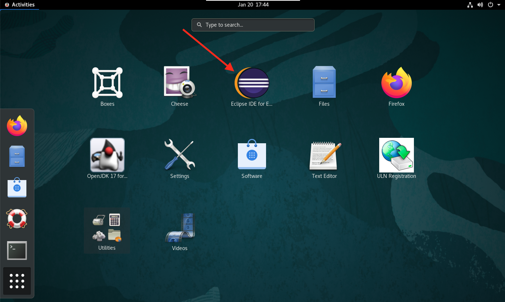

As Eclipse starts you will be presented with a start up "splash" then workspace selection option. 

  3. Set the Eclipse workspace to be `/home/opc/workspace` (If you chose a different location you will have to remember to use that new location in many later stages.)

  

  4. Click the **Use this as the default and do not ask again** option, then the **Launch** button

  

You will be presented with the Eclipse startup. This may include a welcome page. You can close it by clicking the **x** as per normal with sub windows.

  

  5. You can close the **Donate**, **Outline** and **Task list** tabs to get the most usage from the screen.

  

This image shows you the empty Eclipse workspace with the non required tabs all closed

  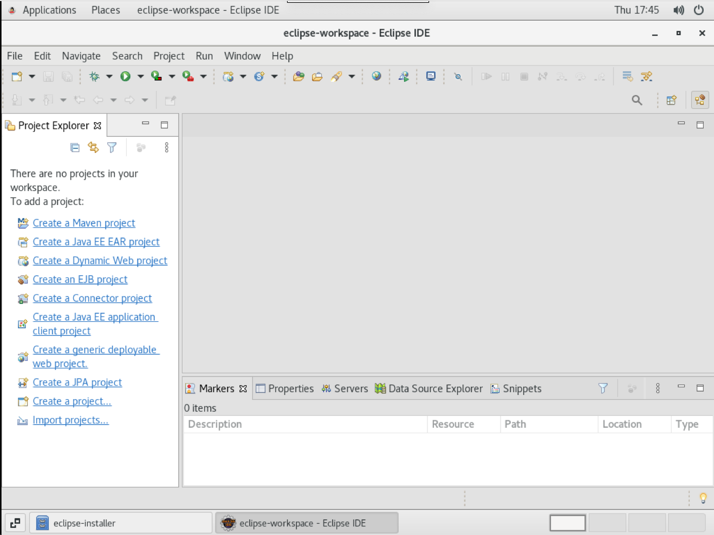

We need to configure Eclipse to display the course files in a hierarchical manner (this is so it matches the images you will have in the lab instructions, if you prefer to use the Eclipse  "Flat" view then you can ignore this step)

  6. Click on the Three dots in the Project Explorer panel, then take the **Package Presentation** menu option and click the radio button for **Hierarchical**

  
  
  In the specific labs (e.g. the Helidon core labs) there are additional instructions on how to get the relevant source code and open it in Eclipse.


## Step 5: Downloading the database Wallet file.

The database Wallet file contains the details needed to connect to your database instance, it needs to be downloaded to the development VM and placed in the right location.

The easiest way to get the database Wallet file into your virtual machine is to use the cloud console to download it.

  1. Open a web browser **inside the virtual machine** by clicking the **Activities** menu on the upper left of the VNC window, then clicking the **Firefox** icon
  
  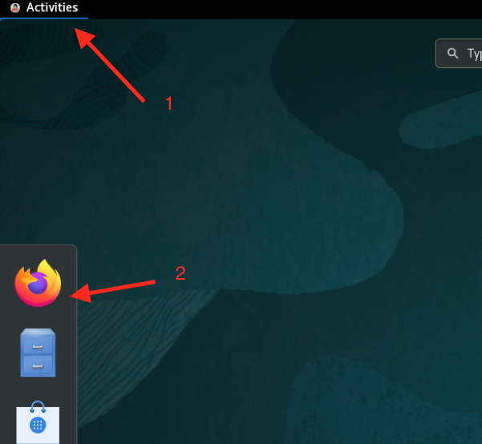
  
  2. Login to the Oracle Cloud Console with your tenancy details
  
  3. Open the "Hamburger" menu (three bars on the top left)
  
  4. Scroll down (if needed) to the **Oracle Database** section. Click on the **Autonomous Transaction Processing** menu option
  
  5. If you need to select the `CTDOKE` compartment you created earlier in the Compartment selector on the left side of the page.
  
  6. Click on your database name in the list (it's a link)
  
  7. On the database page click the **DB Connection** button
  
This will display a Database connection details popup

  8. Leave the **Wallet type** as `Instance connection`
  
  9. Click the **Download Wallet** button
  
  10. A password pop-up will be displayed. Enter and confirm a password, this is used to encrypt some of the details.
  
  11. Once your password is accepted and confirmed click the **Download** button
  
  12. If you are asked what to do with the file make sure you chose the **Save file** option
  
  13. The wallet file will start to download and the password pop-up will disappear and you'll be returned to the **Database connection** pop-up
  
  14. Click **Close** on the **Database Connection** popup


## End of the Setting up your Development VM core module

Congratulations, you have successfully configured trhe code of the development virtual machine, there will be lab specific setup instructions where appropriate in the labs. 

## Acknowledgements

* **Author** - Tim Graves, Cloud Native Solutions Architect, EMEA OCI Centre of Excellence
* **Author** - Jan Leemans, Director Business Development, EMEA Divisional Technology
* **Last Updated By** - Tim Graves, January 2022

