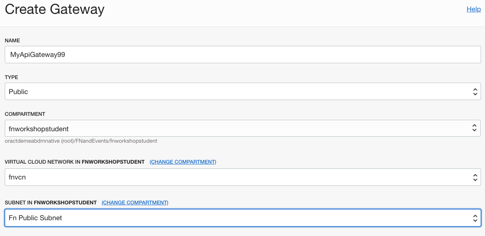
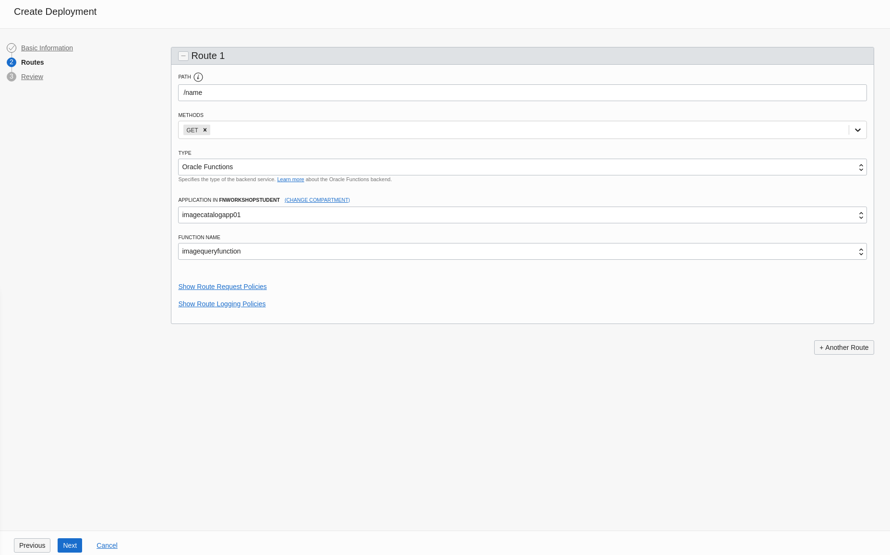

# Fn Handson: Functions and API Gateway

This workshop is optional and can only be attempted if you have completed successfully the [Fn Handson: Functions and Events](FnHandson.md) lab exercise.

The primary focus of this exercise is to have you deploy a 2nd function to your function based application and expose and utilise it through the Oracle API Gateway.
The gateway will be publicly enabled and allow you to query, from a browser, the catalog of image details hosted within an Autonomous Oracle Database that you added to earlier via Object Storage.

## Deploy Image Query Function

From the ssh session to the lab virtual machine you were using earlier, it is possible to locate a 2nd function that has already been created for you and deploy it to your existing function based application.
The function has been made available with a zip file located in the root directory of the opc user you are using.
 
Locate the imagequeryfunction.zip file in the /home/opc directory and unzip it:

```bash
$ cd /home/opc
$ unzip imagequeryfunction.zip
```

Change directory into the newly created *imagequeryfunction* directory:

```bash
$ cd imagequeryfunction
```

This is a complete java based function that's ready to deploy. Feel free to examine the code. 

Note the the handleRequest method takes an HTTPGatewayContext object that encapsulates the entire HTTP request used to invoke the function. The Fn framework deals with marshalling everything required and passing the HTTPGatewayContext to the method. The function will read a query parameter from the URL and use this to query the ATP database via the ORDS API. 

Before deploying check you are using the OCI Fn context:

```bash
$ fn ls ctx
```

Ensure that the asterisk is by the context named oci. 

```
CURRENT	NAME	PROVIDER	API URL							        
	    default	default		http://localhost:8080
*	    oci	    oracle		https://functions.eu-frankfurt-1.oraclecloud.com
```

Deploy the function:
In the example command below be sure to replace the *NN* with your specific user id


> $ fn --verbose deploy --app imagecatalogapp***NN***


The output should indicate that the function has been updated. 

Check in the OCI Functions Service console to see that the new function has been deployed to the imagecatalogapp*NN* application where *NN* is your specific function based application. 


## Create API Gateway

Now that the function is in place, you will create a new API gateway to expose the query functionality to the outside world through. 

In the OCI console select the top right "hamburger"  menu:

Look down the list of services to "Developer Services" then press the mouse on "API Gateway". 


**NOTE**
Before you can create a new Gateway you must ensure that you are on the ***fnworkshopstudent*** compartment.

If you are unsure as to how to do this, please refer to the student handout you were given at the start of the functions labs and if this is not sufficient please reach out to one of the trainers with you.

To create a new gateway click the blue  button. 

Complete the details of the new gateway in the form that is presented below:

Name: **MyApiGateway*NN*** (where *NN* is your student number)

Type: **Public**

Compartment: **fnworkshopstudent** - see above or student handout if unsure how to find this in the compartment picker.

Virtual Cloud Network: **fnvcn**

Subnet: **Fn Public Subnet**

The form should look like this (only with your student number):



Once complete, press the blue "Create" button at the bottom of the page. 

The API Gateway will be provisioned which can take roughly 3 minutes. 


The API Gateway will then transition to the active state:


We will now create a deployment in the new API gateway that will allow us to route traffic to the new function.

Select "Deployments" in the Resources pane below the green active icon. 

In the next screen select the blue  button. 

In the following wizard screen you will specify the details of your new deployment step by step 'from scratch', we can also upload a JSON format file that specifies the deployment's details. 

Complete step 1 with the following details: 

Name: **fndeployment01**

Path Prefix: **/imagequery**

Compartment: **fnworkshopstudent** - see above or student handout if unsure how to find this in the compartment picker.


Leave the rest of the values at the default and press **Next**. 

In Step 2 add a single route with the following values:

Path: **/name/{query}** - this specifies a URL query parameter will be sent in calls to the function. 

Methods: **GET**

Type: **Oracle Functions**

Application: **imagecatalogapp*NN*** (where *NN* is your student number)

Function Name: **imagequeryfunction**



Press **"Next"** and on the summary page select "Create" to create the deployment. 

The deployment will take a few moments to create. 

## Invoke the Function via the API gateway

To invoke the query via the gateway we need to obtain the gateway's public hostname. 

In the OCI API Gateway console, find the details page for the gateway **deployment** you just created and locate the Endpoint field. 


Select Show to see the public hostname and copy to copy it. The hostname format will be similar to the below:

```
https://j4eqxpligw8vmfybhresyi5lte.apigateway.eu-frankfurt-1.oci.customer-oci.com/imagequery
```

Paste the complete URL into a browser window on your laptop and you should see a message similar to this: 

```json
{
"message": "Not Found",
"code": 404
}
```

To actually invoke the function we need to append the route's path which you defined as "**/name**" earlier along with the search query parameter. 

For example to search for files that have jpg in the name use the following URL:


> https://j4eqxpligw8vmfybhresyi5lte.apigateway.eu-frankfurt-1.oci.customer-oci.com/imagequery/name/jpg


You should see the response similar to this:

```json
{
"items": [
{
"bucketname": "fnuser99",
"name": "trooper.jpg",
"uploaded": "2020-01-22T14:04:29Z",
"compartmentname": "fnworkshopstudent",
"id": 1,
"url": "https://objectstorage.eu-frankfurt-1.oraclecloud.com/n/oractdemeabdmnative/b/fnuser99/o/trooper.jpg"
}
]
}
```

Congratulations you have been able to deploy a new function that uses the REST api to query our ATP database and have it exposed to be accessible via the API Gateway!
