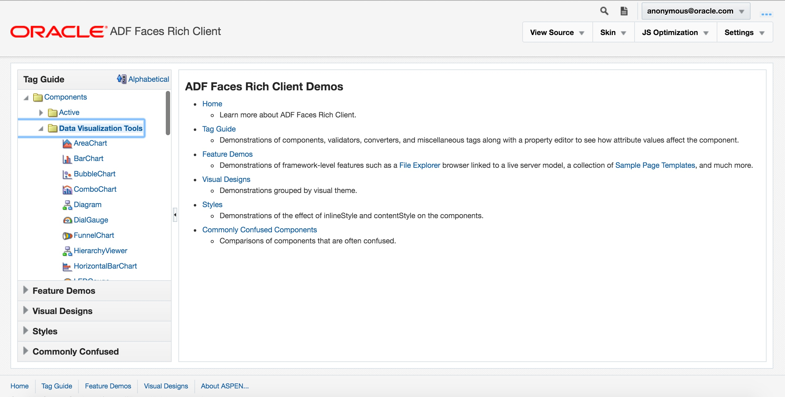
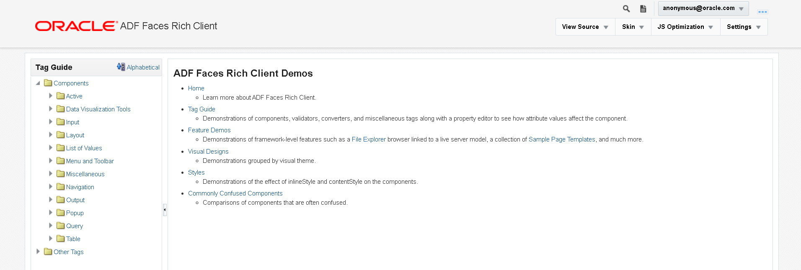
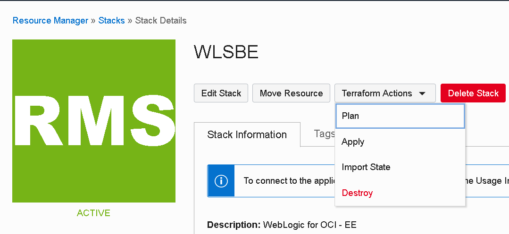
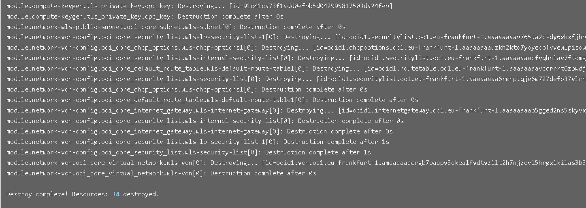

# WebLogic for OCI (JRF)

## Optional steps

This chapter contains 2 optional steps you can execute :

- Deploying a 2nd ADF application that showcases all the features of an ADF Faces Rich Client
- Destroy the various resources you created in this lab to preserve resources on your tenancy

## Step 5. [Optional] Deploy ADF Faces Rich Client Components Demo Application

If you want to explore the ADF Faces components at runtime, the ADF Faces development team at Oracle created a component demo that showcases the various components and framework capabilities and allows you to try different property settings on the selected component. The components demo is provided with full source code and is a great way to learn how to work with the components in general. 

- First, download the [faces-12.2.1.4.0.war](https://objectstorage.eu-frankfurt-1.oraclecloud.com/n/oractdemeabdmnative/b/ll-wls-bucket/o/faces-12.2.1.4.0.war) application web archive. Then, in a similar way as at step **Deploy sample ADF application**, install the faces-12.2.1.4.0.war application. 

- Then, from *Deployments* -> *Control* tab start the application:

- Once *Active*, another browser tab navigate to *https://< public load balancer IP >/faces-12.2.2.1.0/*:

The **Tag Guide** is the entry link to the component demo and shows a list of ADF Faces components that you can select to further explore. Each component demo is launched in a browser that has a split screen layout. The split screen's right content area has a property inspector functionality that you can use to set properties for the individual component. Note that the right content area might be closed so that you have to drag it open before using it. Also of interest is that in addition to the rich client components, the data visualization components which allow you to graphically represent your data are also present in this listing.

The **Feature Demos** include a variety of demonstrations for the frameworks capabilities including a rich set of demos for the data visualization components, active data services, drag and drop and other client behaviors.

A demo of interest should be the **Styles** demo. Users frequently get confused by which part of a component is styled by the **inlineStyle** attribute and which part is styled by the **contentStyle** attribute. The demo also contains a skinning demonstration that allows developers to play with various skin definitions per component.

## Step 6. [Optional] Destroy resources

If you don't plan to use the WebLogic Domain anymore, to spare tenancy resources, the quickest way to delete the resources created during this lab is to run *Terraform Destroy*  on the Stack.

- Navigate to *Solutions and Platform* > *Resource Manager* > *Stacks*, identify and click on the Stack name you have created at the beginning of this lab.

- By running the *Destroy* Terraform Action, a Terraform job will kick off and delete all created resources.

- When the job ends, you should see a similar log output:

You can check that the Compute Instances and the Block Volumes have been terminated.

- At the end you can also delete the Stack:

