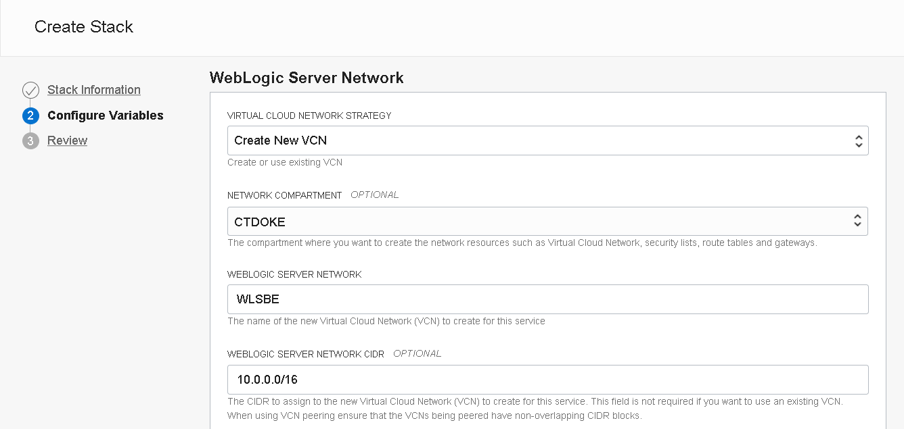
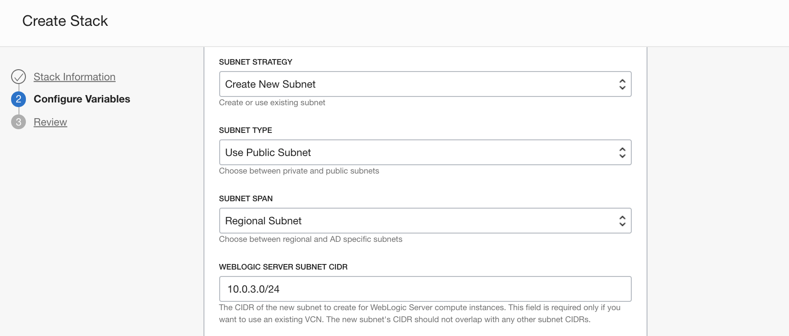
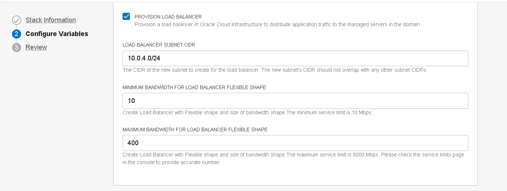

# WebLogic for OCI - non JRF


## Objective

This Hands on Lab will go through the process of creating a non JRF type of WebLogic for OCI Instance - using Oracle Cloud Marketplace - and through the steps of deploying a simple application.


## Step 1. Create WebLogic for OCI Stack

- After logging in, go to Hamburger Menu, *Solutions and Platform* -> *Marketplace*:


- You can choose to browser-search for *WebLogic Server*, or you can apply the filters:
  - **Type**: *Stack*
  - **Publisher**: *Oracle*
  - **Category**: *Application Development*


- Choose *WebLogic Server Enterprise Edition UCM*; This brings you to the Stack Overview page:


- Make sure *CTDOKE* compartment is selected and to accept *Oracle Terms of Use*:


- Fill in Stack information:
  - **Name**: *WLSNN* - where **NN** is your unique suffix given by the instructor
  - **Description**: Any meaningful description, maybe type in your name/initials
- Click **Next**


- Start to fill in details:

  - **Resource Name Prefix**: *WLSNN* - where **NN** your unique suffix
  
  - **WebLogic Server Shape**: *VM.Standard2.1*
  
  - **SSH Public Key**: copy and paste the content from the provided **weblogic_ssh_key.pub** file; it contains the public key in RSA format; be sure to include the whole content in one line, including *ssh-rsa* part at the beginning.
  
    - Note: if you have used the Cloud Shell to generate the weblogic ssh key, you can use the `cat` command to display its contents:
  
      ```
      cat weblogic_ssh_key.pub
      ```
  
      
  
    - On Windows, use `Ctrl+INSERT` to copy the highlighted aria as in the above example.
  
    - On Mac, you can simply use `command+c`


---


- Continue setting up:

  - **WebLogic Server Node count**: *2* (we will create a WebLogic cluster with two nodes / managed servers)
  
  - **Admin user name**: *weblogic*
  
  - **Secrets OCID for WebLogic Server Admin Password**: Enter the OCID of the Secret that was set up earlier for this.  If you if you are using the CTD (Cloud Test Drive) environment, this OCID might be in a document provided by your instructor.

      - A bit of context: the WebLogic Server Admin Password it's stored in an OCI Vault as an OCI Secret (encrypted with an OCI Encryption Key); during WebLogic Domain creation, the provisioning scripts will setup the admin password by getting it from the OCI Secret instead of having it as a Terraform variable; in a similar way - if talking about an JRF enabled domains - the database admin password will be referred from an OCI Secret
      
  
      


- Don't change WebLogic Server Advanced Configuration

- WebLogic Server Network parameters:

  - Choose *Create New VCN*

  - Choose the same *CTDOKE* Compartment

  - Give a name to the Virtual Cloud Network

    

  - For the Subnet Strategy:

    - *Create New Subnet*
    - *Use Public Subnet*
    - *Regional Subnet*

    

  - Tick to **Enable Access to Administration Console**:

    

  - Tick to **Provision Load Balancer**

    - **Load Balancer Minimum and Maximum Bandwidth**: keep defaults

    


- Leave Identity Cloud Service Integration **unchecked** as default (no integration) 
- Leave **OCI Policies** checked, as a Dynamic Group containing the WebLogic Compute nodes will be created automatically alongside policies for letting them access the Secrets from Vault


- Leave **Provision with JRF** unchecked, as we will not associate this WLS instance with a database
- Leave **Configure Application Datasource** also unchecked, as we will not use application datasources


- Review the Stack configuration and click **Create**:


- A Stack Job is being kicked off and our WebLogic Domain starts to be provisioned. Console context moves to Stack's details page (*Solutions and Platform* > *Resource Manager* > *Stacks*):


- While all resources being created we can check the Job Logs; it helps fixing potentially configuration errors if the provisioning fails:


- After approx. 15 minutes, the Job should complete with success:


- We can check the *Outputs* section of Job Resources and see two important values:
  - **Sample Application URL** (we can can try it at this moment, but the out of the box sample application won't load as we need to finish the SSL configuration of the Load Balancer)
  - **WebLogic Server Administration Console**


- Let's check the **WLS admin console** of the newly created WebLogic Server; as we have chosen a Public Subnet for the WLS network, both Compute instances that have been created have public IPs associated.  Use the Console URL provided in the **Outputs** section as shown above
- Login with **weblogic** username and the provided password:


- We can see that our domain has one admin server and two managed servers:


- We can check the Compute Instances to see what has been provisioned; From OCI menu choose *Core Infrastructure* -> *Compute* -> *Instances*:


- We can see two instances having our prefix setup during Stack configuration; one of them runs the WebLogic Admin server and a Managed Server and the other runs the second Managed Server:


- We can check now if the out of the box deployed application is loading; From the Stack Job **Outputs**, open the **Sample Application URL**; it's loading, but we have to bypass the browser warning as the Public Load Balancer is configured with a Self Signed Certificate;
- Click **Advanced** button and **Proceed to ...** to continue:


- The out of the box deployed sample application is being served through a secured SSL Load Balancer Listener:


- Congratulations! Your WLS domain is up&running! 


## Step 2. Deploy custom sample application

- Let's go back to the WebLogic Server admin console to deploy our sample web application:


- Go to *Domain Structure* menu, *Deployments*; **Lock & Edit** to switch to edit mode; Click **Install**:


- Follow **Upload your files** link and upload provided [SampleWebApp.war](resources/SampleWebApp.war) web archive file:


- Click **Next**, **Next**, leave *Install de deployment as an application* default option; click **Next**:


- Choose deploying the application on WebLogic Cluster; click **Next**:


- Leave default settings and click **Next**:


- Choose *No, I will review the configuration later* and click **Finish**


- **Activate Changes**:


- The application is now in *Prepared* state; switch to *Control* tab:


- Select the *SampleWebApp* web application and click **Start** -> **Serving all requests**; Click **Next** in the following screen:


- The *SampleWebApp* web application is in the *Active* State now:


- Now, test this new application at *https://< public load balancer IP >/SampleWebApp/*

 

- Click on the link to test this sample application:


- This is just another sample application, but you can deploy any other application; Congratulations!


## Step 3. [Optional] Destroy resources

If you don't plan to use the WebLogic Domain anymore, to spare tenancy resources, the quickest way to delete the resources created during this lab is to run *Terraform Destroy*  on the Stack.

- Navigate to *Solutions and Platform* > *Resource Manager* > *Stacks*, identify and click on the Stack name you have created at the beginning of this lab.

- By running the *Destroy* Terraform Action, a Terraform job will kick off and delete all created resources.


- When the job ends, you should see a similar log output:


You can check that the Compute Instances and the Block Volumes have been terminated.

- At the end you can also delete the Stack:


