# WebLogic for OKE (JRF) - deploy applications

### Deploying Sample Application and Custom applications


## Objective

In this Hands on Lab we start using the available Jenkins Pipelines to deploy on the WebLogic Domain the standard Sample Application and new applications as well. The same approach can be used for migrating applications from on-premise environments to WebLogic Domain on Kubernetes as the applications package and domain model extracted with WDT can easily passed as input parameters to one of the provided Jenkins Pipelines.

Note: Keep previous lab as a reference for connecting to Jenkins console or WebLogic Admin Console. This Hands on Lab won't provide step by step instructions on how to do it.


## Step 1. Deploy Sample Application

Login to Jenkins Console:

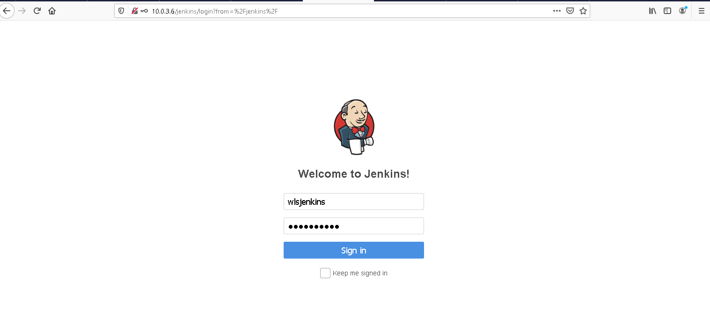


You should see Jenkins Dashboard Page and available Pipelines:

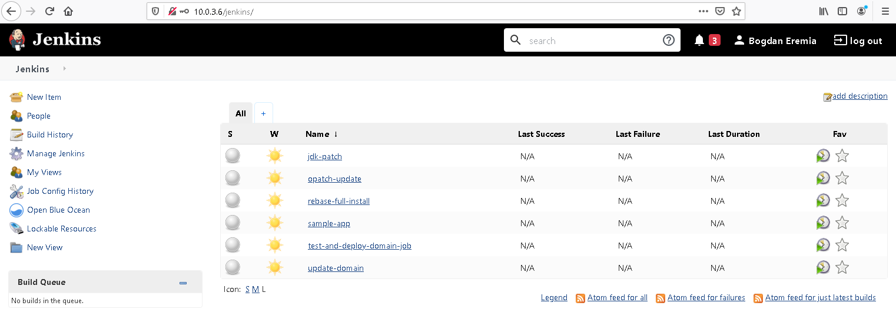


These Pipelines are provided as default examples, but you can change them or you create new ones as needed. As this is a fresh environment, no Pipeline has never been run yet so we don't see build history data.

To deploy the WebLogic Sample Application, we have a Pipeline called *sample-app*. This Pipeline will call *test-and-deploy-domain-job* Pipeline. To shorten the total time of execution of the Pipeline and spend less time on completing this Hands on Lab, we need to comment some steps in the *test-and-deploy-domain-job* Pipeline. Click on it:


Click on *Configure* in the Pipeline menu, then scroll down or switch to *Pipeline* tab:

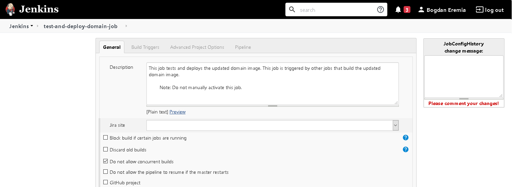


You'll see now the Pipeline's Groovy Script:


Inspect the Pipeline Script. We need to skip **TEST_DOMAIN** and **TEST_DOMAIN_VALIDATION** execution. The easy way is to comment the content of the steps section of these stages (but leave first `echo` command uncommented). The new code should look like this:

```
            stage("TEST_DOMAIN") {
            steps {
            echo "Creating Test Domain image... "
//
//            echo "BUILD_TS: ${params.BUILD_TS}"
//            script {
//            ARGS = params.ARGS + " -b " + params.BUILD_TS
//            }
//            wrap([$class: 'MaskPasswordsBuildWrapper', varPasswordPairs: [[password: '${ARGS}', var: 'SECRET']]]) {
//            sh "/u01/shared/scripts/pipeline/common/test_domain_common.sh ${ARGS}"
//            }
            }
            post {
            failure {
            echo "Failed in test domain"
            }
            unstable {
            echo "Unstable in test domain"
            }
            }
            }
            /*
            Test domain validation:
            Test domain created in the previous stage is validated by checking if the server pods start in ready/running
            state.
            */
            stage("TEST_DOMAIN_VALIDATION") {
            steps {
            echo "Validating Test Domain image... "
//            wrap([$class: 'MaskPasswordsBuildWrapper', varPasswordPairs: [[password: '${ARGS}', var: 'SECRET']]]) {
//            sh "/u01/shared/scripts/pipeline/common/validate_test_domain_common.sh ${ARGS}"
//            }
            }
            post {
            failure {
            echo "Failed in validate test domain"
            }
            unstable {
            echo "Unstable in validate test domain"
            }
            }
            }
```


Click the **Save** button:

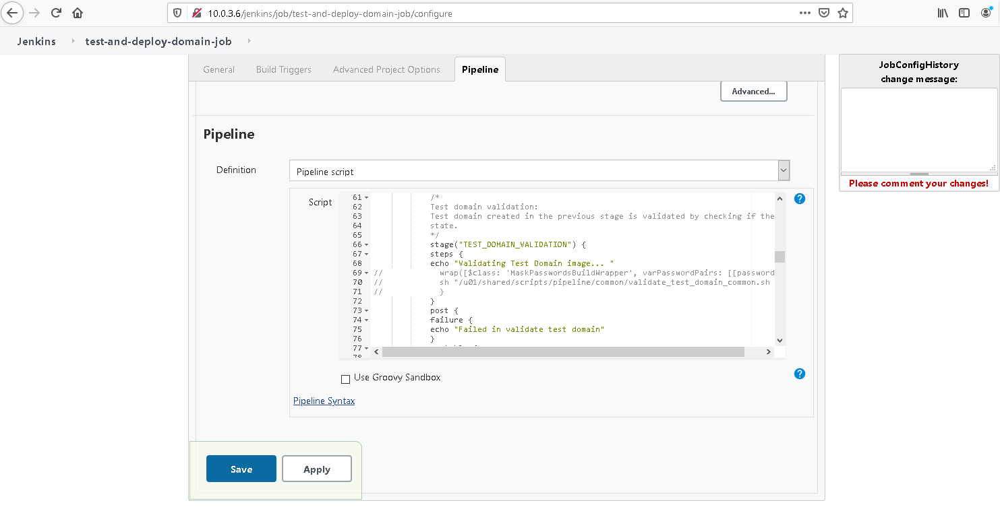


Now go *Back to Dashboard*:


Hover on *sample-app* Pipeline, expand the contextual menu and click on **Build with Parameters**:


Click on **Build** to deploy the Sample Application:


Once build starts, you're redirected to Pipeline's *Status* Page. This page will get updated once build stages are running and completed.

To check the build log, hover the build number in the Build History section, expand the contextual menu and click on **Console Output**:

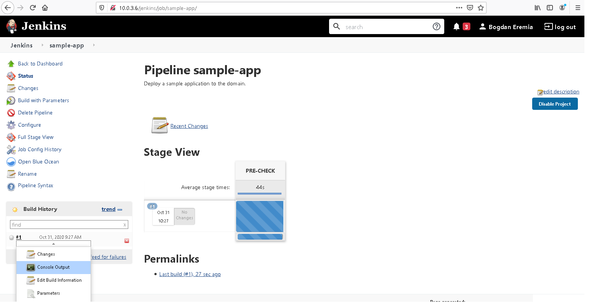


The running build output logs are displayed:


After ~14min, if you go back to Status page, you should see the Build completed:


Next step, is to access and test the WebLogic Sample Application. In a new browser tab navigate to:

(check the previous lab on how to get the Public Load Balancer IP by inspecting the Load Balancers or the WebLogic for OKE stack Apply Job output logs)

```
https://<public load balancer ip>/sample-app
```


If you see a messages warning about the serf signed certificate of the Load Balancer, just proceed forward (*Accept Risk and Continue*):

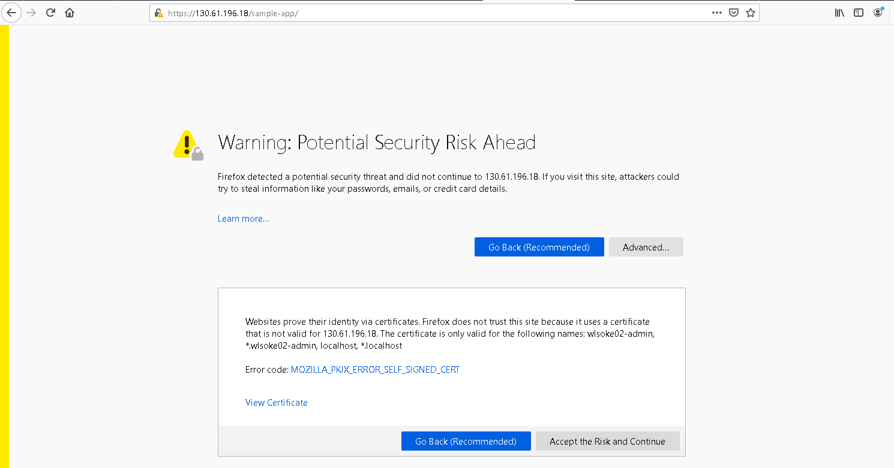


WebLogic Sample Application up & running:


## Step 2. Deploy custom ADF Application

In the second step of this Hands on Lab we will use the *update-domain* Pipeline to deploy a custom ADF application alongside required database data source.

Let's inspect the required Build Parameters to launch this Pipeline:


Pipeline's Build Parameters:


As this Pipeline executes the **WebLogic Deploy Tool** (**WDT**) *updateDomain* command, we can recognized the WDT parameters 

- **Archive_Source**: The archive file is used to deploy binaries and other file resources to the target domain. The archive is a ZIP file with a specific directory structure.
- **Domain_Model_Source**: The metadata model (or model, for short) - the version-independent description of a WebLogic Server domain configuration in YAML format
- **Variable_Source**: Variables Properties file that can be passed and interpreted at execution
- **Encryption_Passphrase**: In case the model or variables properties file are encrypted, the encryptions passphrase should be passed here 


We can, of course, use WDT to introspect an existing WebLogic Environment and generate the domain model and applications archive, but very easy we can manually create these artefacts when we already have the WebLogic Applications.


Let's start by  downloading this Sample ADF Application: [SampleADFApplication.ear](https://objectstorage.eu-frankfurt-1.oraclecloud.com/n/oractdemeabdmnative/b/ll-wls-bucket/o/SampleADFApplication.ear)(click on the link).

Create the following folder structure on your local machine and move the `SampleADFApplication` file in the `applications` folder:

```
wlsdeploy > applications > SampleADFApplication.ear
```


Zip the entire `wlsdeploy` folder creating an archive, for example `wlsapps.zip`. (the archive will include the above folder structure and `SampleADFApplication.ear` file)


Create a file called `wlsapps.yaml` with following content and adapt it following below Notes:

```
resources:
    JDBCSystemResource:
        'adfapp-ds':
            Target: 'wlsoke02-cluster,wlsoke02-cluster'
            JdbcResource:
                JDBCConnectionPoolParams:
                    InitialCapacity: 0
                    TestConnectionsOnReserve: true
                    ConnectionCreationRetryFrequencySeconds: 10
                    TestTableName: SQL ISVALID
                    TestFrequencySeconds: 300
                    SecondsToTrustAnIdlePoolConnection: 0
                JDBCDataSourceParams:
                    JNDIName: jdbc/adfappds
                JDBCDriverParams:
                    URL: 'jdbc:oracle:thin:@(description=(retry_count=20)(retry_delay=3)(address=(protocol=tcps)(port=1522)(host=adb.eu-frankfurt-1.oraclecloud.com))(connect_data=(service_name=cgipkrq1hwcdlkv_wlsatpdb_low.adb.oraclecloud.com))(security=(ssl_server_cert_dn=""CN=adwc.eucom-central-1.oraclecloud.com,OU=Oracle BMCS FRANKFURT,O=Oracle Corporation,L=Redwood City,ST=California,C=US"")))'
                    PasswordEncrypted: 'Welcome1234#'
                    DriverName: oracle.jdbc.OracleDriver
                    Properties:
                        user:
                            Value: ADFAPP
                        oracle.net.CONNECT_TIMEOUT:
                            Value: 120000
                        SendStreamAsBlob:
                            Value: true
                        oracle.net.tns_admin:
                            Value: /u01/data/domains/wlsoke02/config/atp
                        javax.net.ssl.trustStore:
                            Value: /u01/data/domains/wlsoke02/config/atp/truststore.jks
                        javax.net.ssl.trustStoreType:
                            Value: JKS
                        javax.net.ssl.trustStorePassword:
                            Value: 0efbfe5d14364b94853f917a12cd7878
                        javax.net.ssl.keyStore:
                            Value: /u01/data/domains/wlsoke02/config/atp/keystore.jks
                        javax.net.ssl.keyStoreType:
                            Value: JKS
                        javax.net.ssl.keyStorePassword:
                            Value: 0efbfe5d14364b94853f917a12cd7878
                        oracle.net.ssl_server_dn_match:
                            Value: true
                        oracle.net.ssl_version:
                            Value: '1.2'
appDeployments:
    Application:
        'SampleADFApplication':
            SourcePath: 'wlsdeploy/applications/SampleADFApplication.ear'
            Target: 'wlsoke02-cluster'
            ModuleType: war
            StagingMode: nostage
```


**Note 1**: For the *'adfapp-ds'* datasource and *'SampleADFApplication'* application **Target** attributes, replace **wlsoke02-cluster** value with the WebLogic Cluster name in your specific environment. To get it, connect to WebLogic Admin Console and navigate to *Clusters* page:


**Note 2**: For the *'adfapp-ds'* data source **URL** value, copy and paste the connection string from an existing data source , for example from *'mds-owsm'* data source. On WebLogic Admin Console navigate to *Services* > *Data Sources* page and click on *mds-owsm*:

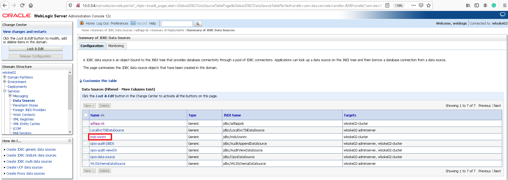


Switch to **Connection Pool** tab and copy the entire **URL** value:

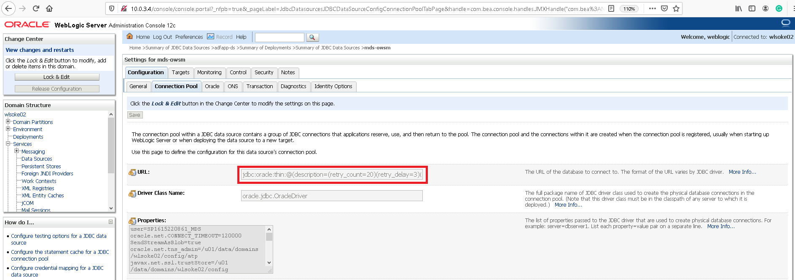


In the  `wlsapps.yaml`  file replace the **URL** value with the string just copied from the data source connection pool page. Make sure to escape the double quotes (**"**) characters in the string value by adding another double quote characters in front, as in the above example (before the **CN** and after **US** values):

> URL: 'jdbc:oracle:thin:@(description=(retry_count=20)(retry_delay=3)(address=(protocol=tcps)(port=1522)(host=adb.eu-frankfurt-1.oraclecloud.com))(connect_data=(service_name=cgipkrq1hwcdlkv_wlsatpdb_low.adb.oraclecloud.com))(security=(ssl_server_cert_dn=**"**"CN=adwc.eucom-central-1.oraclecloud.com,OU=Oracle BMCS FRANKFURT,O=Oracle Corporation,L=Redwood City,ST=California,C=US**"**")))'


**Note 3**: Do similar replacements for the following **Properties** of the data source:

- oracle.net.tns_admin
- javax.net.ssl.trustStore
- javax.net.ssl.trustStorePassword
- javax.net.ssl.keyStore
- javax.net.ssl.keyStorePassword


You can find the values here:

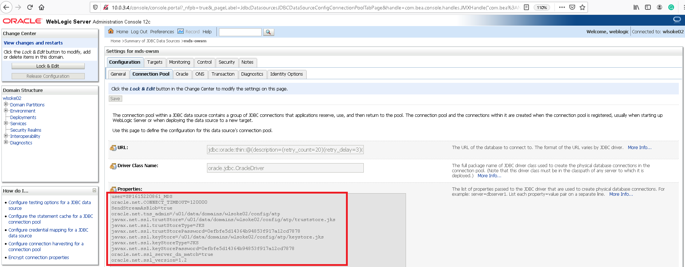


**Note 4**: You can put multiple applications in the applications archive. Don't forget to update the model accordingly, by putting a distinct section for each application, under the `Application:`  parent section.


For this lab example, we don't use a variables properties file, nor an encryption passphrase to pass for running the *update-domain* Pipeline.

In the Pipeline build form, select *File Upload* for **Archive_Source** and **Domain_Model_Source** and upload the two files:


Click on **Build** to start updating the WebLogic Domain and deploying the Sample ADF Application:

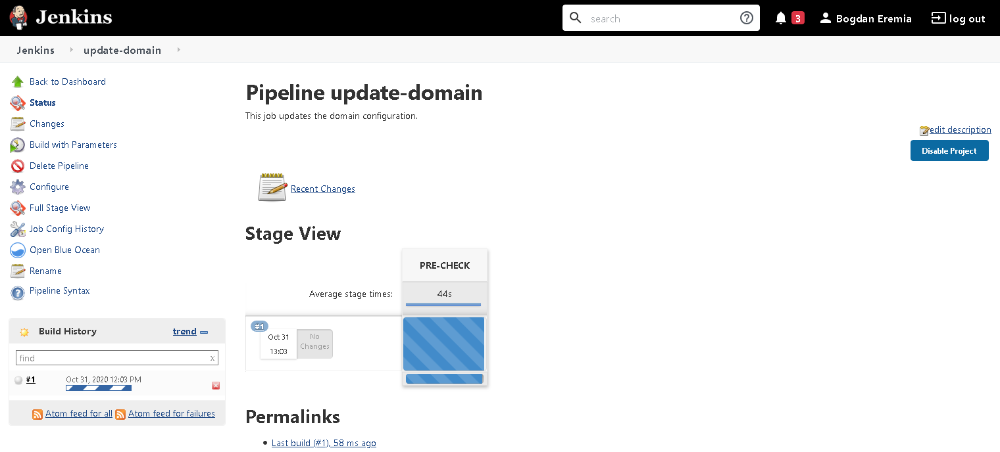


After a while (~22min) the Build should have been completed:

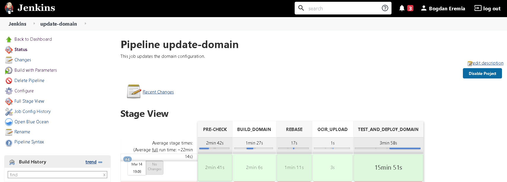


While waiting, we should do one more configuration for the ADF application to run properly: we need to configure the Kubernetes Ingress Resource associated with the WebLogic cluster applications to support pod affinity. This is required so that, based on the ADF Application cookie values, the requests are sent to the same Pod (cookie persistence).


Access the *Admin Compute Host* (check the previous lab for how to do that) and list the Kubernetes Ingress Resources:

> $ kubectl get ingress -A


We should see tree distinct ones:

> NAMESPACE            NAME                        CLASS    HOSTS   ADDRESS         PORTS   AGE
> jenkins-ns           jenkins-dashboard-ingress   <none>   *       10.0.3.4        80      6d3h
> wlsoke02-domain-ns   wls-admin-ingress           <none>   *       10.0.3.4        80      6d3h
> wlsoke02-domain-ns   wls-cluster-ingress         <none>   *       193.122.49.85   80      6d3h


The `wls-cluster-ingress` handles the external traffic, and we can see that it’s using a different NGINX Ingress Controller instance:

> $ kubectl get ingress -A -o custom-columns=NAME:.metadata.name,CLASS:.metadata.annotations."kubernetes\.io/ingress\.class"
> NAME                        CLASS
> jenkins-dashboard-ingress   nginx
> wls-admin-ingress           nginx
> wls-cluster-ingress         nginx-applications


To setup session persistence, we need to add at least two annotations to the `wls-cluster-ingress` Ingress:

> nginx.ingress.kubernetes.io/affinity: cookie
> nginx.ingress.kubernetes.io/affinity-mode: persistent


Besides, we also need to map a hostname for the default route. For this case, let's setup the `wlsoke.com` host. <u>You also need to edit on your laptop the local `/etc/hosts` file to map it with the public load balancer IP address</u>. 

To edit the Ingress:


> kubectl edit ingress wls-cluster-ingress -n wlsoke02-domain-ns

(instead of the example **wlsoke02-domain-ns** namespace, use the weblogic domain namespace corresponding to your Kubernetes cluster; see `$ kubectl get ingress -A` above command output)


After adding the above, the Ingress .yaml file should look like this:

```
# Please edit the object below. Lines beginning with a '#' will be ignored,
# and an empty file will abort the edit. If an error occurs while saving this file will be
# reopened with the relevant failures.
#
apiVersion: extensions/v1beta1
kind: Ingress
metadata:
  annotations:
    kubernetes.io/ingress.class: nginx-applications
    meta.helm.sh/release-name: ingress-controller
    meta.helm.sh/release-namespace: default
    nginx.ingress.kubernetes.io/affinity: cookie
    nginx.ingress.kubernetes.io/affinity-mode: persistent
    nginx.ingress.kubernetes.io/configuration-snippet: |
      more_clear_input_headers "WL-Proxy-Client-IP" "WL-Proxy-SSL";
      more_set_input_headers "X-Forwarded-Proto: https";
      more_set_input_headers "WL-Proxy-SSL: true";
      more_set_input_headers "is_ssl:ssl";
  creationTimestamp: "2021-03-08T16:29:07Z"
  generation: 2
  labels:
    app.kubernetes.io/managed-by: Helm
  managedFields:
  - apiVersion: extensions/v1beta1
    fieldsType: FieldsV1
    fieldsV1:
      f:metadata:
        f:annotations:
          .: {}
          f:kubernetes.io/ingress.class: {}
          f:meta.helm.sh/release-name: {}
          f:meta.helm.sh/release-namespace: {}
          f:nginx.ingress.kubernetes.io/configuration-snippet: {}
        f:labels:
          .: {}
          f:app.kubernetes.io/managed-by: {}
    manager: Go-http-client
    operation: Update
    time: "2021-03-08T16:29:07Z"
  - apiVersion: networking.k8s.io/v1beta1
    fieldsType: FieldsV1
    fieldsV1:
      f:status:
        f:loadBalancer:
          f:ingress: {}
    manager: nginx-ingress-controller
    operation: Update
    time: "2021-03-08T16:30:38Z"
  - apiVersion: extensions/v1beta1
    fieldsType: FieldsV1
    fieldsV1:
      f:metadata:
        f:annotations:
          f:nginx.ingress.kubernetes.io/affinity: {}
          f:nginx.ingress.kubernetes.io/affinity-mode: {}
      f:spec:
        f:rules: {}
    manager: kubectl
    operation: Update
    time: "2021-03-14T19:55:31Z"
  name: wls-cluster-ingress
  namespace: wlsoke02-domain-ns
  resourceVersion: "2308278"
  selfLink: /apis/extensions/v1beta1/namespaces/wlsoke01-domain-ns/ingresses/wls-cluster-ingress
  uid: 116a65c4-aef1-4b65-9e6b-841fff856061
spec:
  rules:
  - host: wlsoke
    http:
      paths:
      - backend:
          serviceName: wlsoke02-cluster-wlsoke01-cluster
          servicePort: 8001
        path: /
        pathType: ImplementationSpecific
status:
  loadBalancer:
    ingress:
    - ip: 193.122.49.85
```


**Editing notes**:

- add the two annotations before the existing *nginx.ingress.kubernetes.io/configuration-snippet* annotation
- add the *host* entry before the **http** entry with a dash (**-**) in front; remove the dash from the **http** entry 


List the Ingress again; the host value should be present:

> kubectl get ingress wls-cluster-ingress -n wlsoke02-domain-ns
> NAME                  CLASS    HOSTS    ADDRESS         PORTS   AGE
> wls-cluster-ingress   <none>   wlsoke   193.122.49.85   80      6d3h


Add a new entry in your local machine `/etc/hosts` file to map the Public Load Balancer IP address with the **wlsoke** hostname, for example:

> 193.122.49.85	wlsoke 

(for Windows machines, you can find the **hosts** file in `C:\Windows\System32\drivers\etc` directory)


When the Jenkins build job has completed, access and test the WebLogic Sample ADF Application. In a new browser tab navigate to:

```
https://wlsoke/sampleADFApplication
```


Ignore the certificate issue warning raised by the browser:

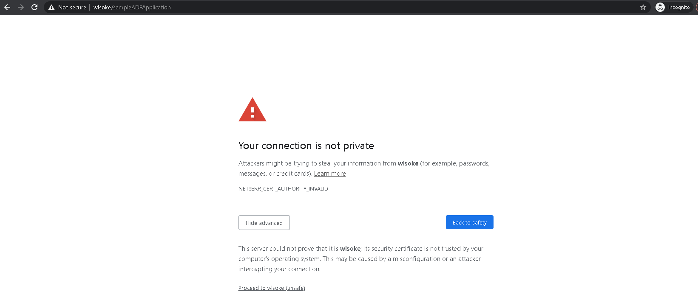


The app should be app & running:

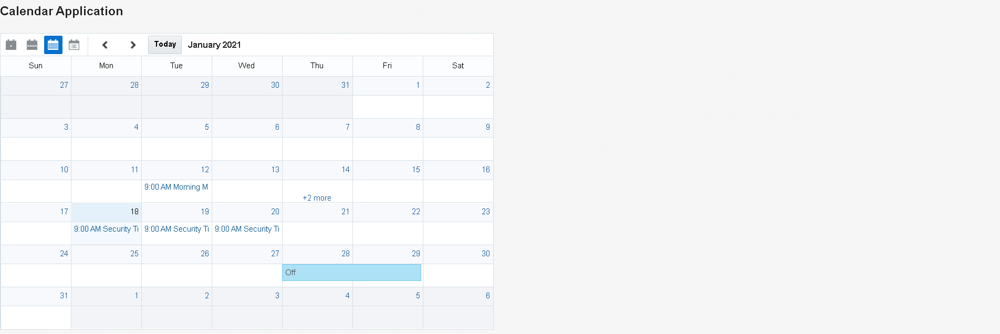


As we can see, calendar entries are coming from the ATP database. Play with the ADF Calendar Component, for example switch to *List view*:


This is just a sample ADF application, but you can deploy any other applications; Congratulations!