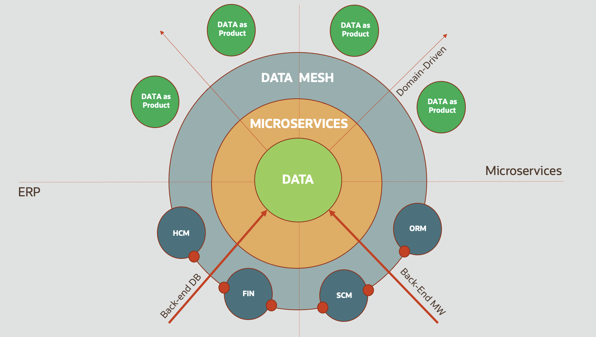
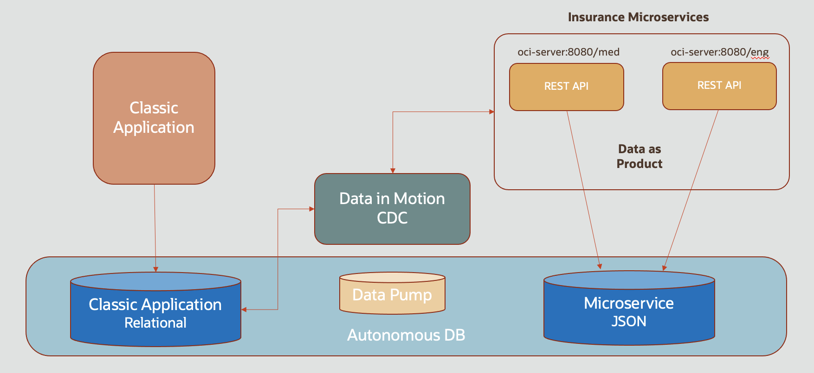

# Introduction and Prerequisites

## Objective of this lab

This Lab will walk you through the steps to set up a Data Mesh to organize your data flows between classic Monolith applications, typically using a relational database schema, and various other applications, for example microserviceq that run in a different location and store their data as JSON text.

### What is a Data Mesh?

Content to be finalized (tbc)

### What will we do in this lab?

In this lab we will walk you through the following steps : 

- Set up an Autonomous Database and 3 schemas: one representing the monolith applciation, one representing the Data Pump environment , and one representing a microservice using JSON
- Creating the GoldenGate Data Pump: create an instance of the OCI GoldenGate cloud service
- Create a VM where we will run the microservices that will act as consumers
- Create 3 schemas in the database: one representing the monolith applciation, one representing the Data Pump environment , and one representing a microservice using JSON
- Configure Source and Target systems in the GoldenGate environment to manage the data flows
- Observe the resulting data flows in the various applications and data sources

### Lab Architecture

## Prerequisites

## Step 1 - Access to an Oracle Cloud environment

To run these labs you will need access to an Oracle Cloud Account.  

<u>We assume you are using your own Oracle Cloud Tenancy,</u> either via a **Free Tier**, using a **Pay-as-you-Go** account, or using the **Corporate account** of your organization.  

==> If you do not have an account yet, you can obtain  an Oracle Free Tier account by [clicking here.](https://signup.cloud.oracle.com/?sourceType=:em:lw:pety:cpo:::RC_WWMK210617P00118:Lab_WeblogicOCI0709)

## Step 2 - Download the files for this lab

We will be using some scripts and application code during this lab.  They have been grouped in a zipfile to be downloaded to your laptop.

- Download the zip file with the various scripts, db schema's and the source code of the microservice to your local machine via **[this link](code/labfiles.zip)**.  
- Unzip the file on your laptop, and remember the location, we will be using these files in the following steps.

## Step 3 - Local notebook

Along this lab we will ask you to note down a series of elements for use later in the lab : IP addresses, hostnames, passwords, compartment names etc.

Make sure you have a **text notebook** open to cut and paste these elements to.  

We advise you to use a **simple text editor** that does not add any layout to the text: for example in Word, you might see simple quotes replaced by an opening quote and a closing quote, which will result in syntax errors when you copy this in a parameter definition file of OCI Goldengate.

## Step 4 - Service limits (Optional)

This lab can be run on a Trial tenancy provided by Oracle, during the initial period of 1 month and assuming you have remaining free credits in this environment.

**Remark** : this lab cannot be executed beyond the first month, when you can only use the **Always Free** entitlements, as OCI Goldengate is not part of the Always Free components. 

Incase you are running this lab on a **paying personal or corporate tenancy**, you might need to check you have the required service limits assigned to your tenancy or compartment :

Going through the hands on labs you will create the following main components in your tenancy:

- a VCN network with public access
- two Autonomous database of the type "Transactional"
- one Compute instance
- one OCI GoldenGate instance
- a API Gateway instance

You may now proceed to the next Lab Step, use the navigation on the left.
