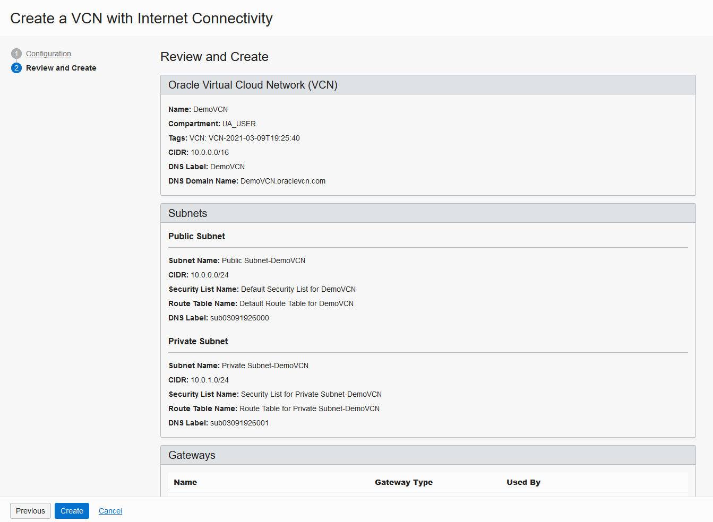

# Creating an Autonomous Database instance

## Task 1: Create a VCN and subnet

1. Open the **Navigation Menu**, navigate to **Networking**, and select **Virtual Cloud Networks**.

   

2. Click **Start VCN Wizard**.

3. Select **VCN with Internet Connectivity**, and then click **Start VCN Wizard.**

   

4. Enter a name for the VCN, select a compartment, and then click **Next**.

   

5. Verify the configuration, and then click **Create**.

   

You can click View VCN Details and see both a Public and Private subnet were created.

## Task 2: Create an ATP Instance

1. Open the **Navigation Menu**, navigate to **Oracle Database**, and select **Autonomous Transaction Processing**.

   

2. Click **Create Autonomous Database**.

   

3. Select **Compartment** by clicking on the drop-down list. (Note that yours will be different - do not select **ManagedCompartmentforPaaS**) and then enter **ATPSource** for **Display Name** and **Database Name**.

   

4. Under **Choose a workload type**, select **Transaction Processing**.

   

5. Under **Choose a deployment type**, select **Shared Infrastructure**.

   

6. Under **Configure the database**, leave **Choose database version** and **Storage (TB)** and **OCPU Count** as they are.

   

7. Add a password. Take note of the password, you will need it later in this lab.

   

8. Under **Choose a license type**, select **License Included**.

   

9. Click **Create Autonomous Database**. Once it finishes provisioning, you can click on the instance name to see details of it.

You can now navigate to the next chapter of this lab