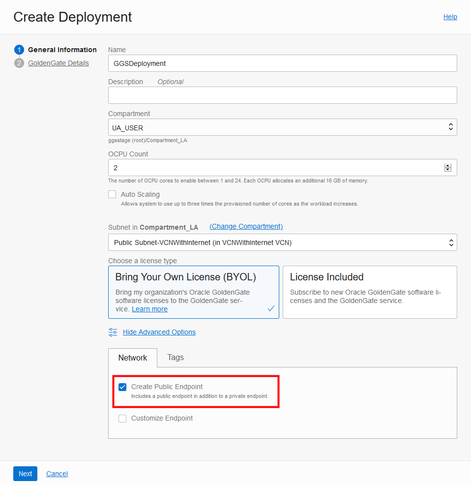

# Data Mesh for Monolith to Microservices

### Set up the 3 environments: Monolith, Data Pump and Microservice

## Introduction

This lab walks you through the steps to create an Oracle Cloud Infrastructure GoldenGate Deployment.

### About Oracle Cloud Infrastructure GoldenGate Deployments
A Oracle Cloud Infrastructure GoldenGate deployment manages the resources it requires to function. The GoldenGate deployment also lets you access the GoldenGate deployment console, where you can access the OCI GoldenGate deployment console to create and manage Extracts and Replicats.

### Objectives

In this lab, you will:
* Locate Oracle Cloud Infrastructure GoldenGate in the Console
* Create a OCI GoldenGate deployment
* Review the OCI GoldenGate deployment details

  

### Prerequisites

This lab assumes that you completed all preceding labs.

## Task 1: Create a Deployment

*Note that the compartment names in the screenshots may differ from values that appear in your environment.*

1.  Open the **Navigation Menu**, navigate to **Oracle Database**, and select **GoldenGate**.

    

    You're brought to the **Deployments** page.

    

2.  If you're prompted to select a compartment, select the compartment associated to your LiveLab workshop. For example, if your LiveLab username is LL1234-user, select the compartment **LL1234-COMPARTMENT**.

2.  On the Deployments page, click **Create Deployment**.

    

3.  In the Create Deployment panel, enter **GGSDeployment** for Name.

4.  From the Compartment dropdown, select a compartment.

5.  For OCPU Count, enter **2**.

6.  For Subnet, select **Public Subnet**.

7.  For License type, select **Bring You Own License (BYOL)**.

9. Click **Show Advanced Options**, and then select **Create Public Endpoint**.

    

9.  Click **Next**.

10. For GoldenGate Instance Name, enter **ogginstance**.

11. For Administrator Username, enter **oggadmin**.

12. For Administrator Password, enter a password. Take note of this password.

13. Click **Create**.

You're brought to the Deployment Details page. It takes a few minutes for the deployment to be created. Its status will change from CREATING to ACTIVE when it is ready for you to use.

## Task 2: Review the Deployment details

On the Deployment Details page, you can:

* Review the deployment's status
* Launch the GoldenGate service deployment console
* Edit the deployment's name or description
* Stop and start the deployment
* Move the deployment to a different compartment
* Review the deployment resource information
* Add tags

    
    
    
    
    

You can now navigate to the next chapter of this lab
