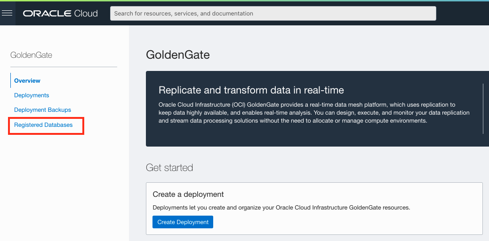
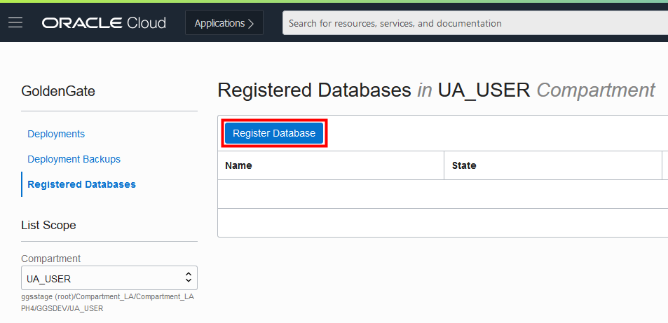
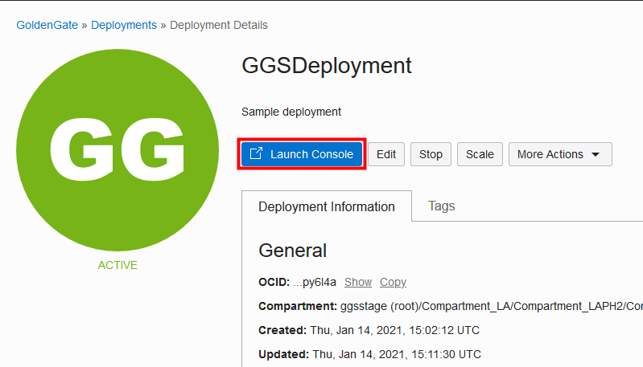
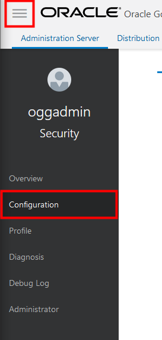
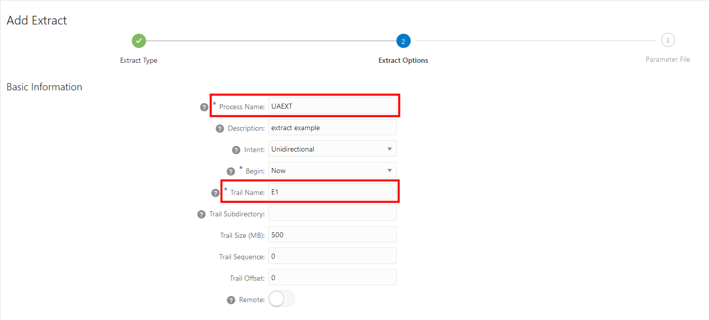

# Configure GoldenGate flows

## Introduction

This lab walks you through the steps to create an Extract and a Replicat in the Oracle GoldenGate Deployment Console.

Estimated Lab Time: 10 minutes

### About Extracts and Replicats
An Extract is a process that extracts, or captures, data from a source database. A Replicat is a process that delivers data to a target database.

### Objectives

In this lab, you will:
* Log in to the Oracle GoldenGate deployment console
* Add transaction data and a checkpoint table
* Add and run an Extract
* Add and run a Replicat


## Step 1 - Register the databases in GoldenGate

We will first register our 2 databases so we can use them in our Goldenate environments

- Log in to Oracle Cloud Infrastructure, open the navigation menu, and then select **GoldenGate** from the **Oracle Database** services.

- Select the **Registered Databases** tab

  

- Click **Register Database**.

  

- In the Register Database panel, for Name and Alias, enter **SourceATP**.

- From the Compartment dropdown, select a compartment.

- Click **Select Database**.

- From the Database Type dropdown, select **Autonomous Database**.

- If necessary, select the compartment where your DB's were created

- Enter the database's password in the Password field, and then click **Register**.

  

  The database becomes Active after a few minutes.

  

- Now repeat this process to register the **TargetADW** database.


## Step 2 - Log in to the Oracle GoldenGate deployment console

1.  Select Deployments menu on the left where you can see the GoldenGate deployment you created earlier.  It should be in the **Active** state.

2. Click on your deployment to see the Deployment Details.

3. On the Deployment Details page, click **Launch Console**.

    

4. On the OCI GoldenGate Deployment Console sign in page, enter **oggadmin** for User Name and the password you provided when you created the deployment, and then click **Sign In**.

    

    You're brought to the OCI GoldenGate Deployment Console Home page after successfully signing in.

## Step 3 - Add Transaction Data and a Checkpoint Table

1.  Open the navigation menu and then click **Configuration**.

    

2.  Click **Connect to database SourceATP**.

    

3.  Next to **TRANDATA Information** click **Add TRANDATA**.

    

4.  For **Schema Name**, enter **OSM**, and then click **Submit**.

5.  To verify, you can enter **OSM** into the Search field and click **Search**.

    

6.  Click **Connect to database TargetADW**.

    

7.  Next to Checkpoint, click **Add Checkpoint**.

    

8.  For **Checkpoint Table**, enter **OSM3.CHECKTABLE**, and then click **Submit**.

    
    
    

- Now return to the GoldenGate Deployment Console Home page:  click **Overview** in the left navigation.


## Step 4 - Add and Run an Extract

1.  On the GoldenGate Deployment Console Home page, click the plus (+) icon for Extracts.

    

2.  On the Add Extract page, select **Integrated Extract**, and then click **Next**.

3.  For **Process Name**, enter UAEXT.

4.  For **Trail Name**, enter E1.

    

5.  Under **Source Database Credential**, for **Credential Domain**, select **OracleGoldenGate**.

6.  For **Credential Alias**, select the **SourceATP**.

    

7.  Under Managed Options, enable **Critical to deployment health**.

8.  Click **Next**.

9. On the Parameter File page, in the text area, add a new line and the following text:

    ```
    TABLE OSM.*;
    ```
    
10. Click **Create**. You're returned to the OCI GoldenGate Deployment Console Home page.

11. In the UAEXT **Actions** menu, select **Start**. In the Confirm Action dialog, click **OK**.

    

    The yellow exclamation point icon changes to a green checkmark.

    

## Step 5 - Add and Run the Replicat

1.  On the GoldenGate Deployment Console Home page, click the plus (+) icon for Replicats.

    

2.  On the Add Replicat page, select **Nonintegrated Replicat**, and then click **Next**.

3.  On the Replicate Options page, for **Process Name**, enter **Rep**.

4.  For **Credential Domain**, select **OracleGoldenGate**.

5.  For **Credential Alias**, select **TargetADW**.

6.  For **Trail Name**, enter E1.

7.  For **Checkpoint Table**, select **"OSM3","CHECKTABLE"**.

    

6.  Under **Managed Options**, enable **Critical to deployment health**.

7.  Click **Next**.

7.  Click **Create**.

11. In the Rep Replicat **Action** menu, select **Start**.

    

    The yellow exclamation point icon changes to a green checkmark.


**Congratulations**, you are ready to move to the last step : validating the data flows!


